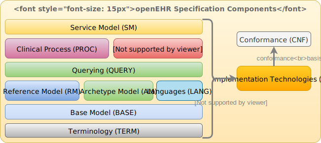

= Overview

This document provides an overview of the openEHR architecture. It commences with a description of the specification project, followed by an overview of the model structure and packages. Key global semantics including security, archetyping, identification, version and paths are then described. The relationship to published standards is described, and finally, the approach to building implementations is outlined.

== The openEHR Specification Program

The {openehr_specification_program}[openEHR Specification Program] is responsible for developing the specifications of openEHR, from which the openEHR Health Computing Platform is implemented. The outputs of the program consist of a number of _components_, as shown in the diagram below, with each component consisting of one or more separate specifications

[.text-center]
.The openEHR Specification project

The components on the left consist of abstract formal vocabulary, languages and UML models for various elements of the openEHR health computing platform. At the bottom is the {openehr_term_component}[Terminology (TERM) component], which contains formal artefacts representing openEHR's internal terminology, along with expressions of various ISO, IETF and other vocabularies (language names, territory names, MIME types, etc) that are not typically published in a directly usable format.

The remaining components on the left of the figure (BASE to SM) define the openEHR platform in a formal abstract form, using UML models and syntax specifications as needed. The components contain the bulk of the openEHR specifications.

Some of these specifications (e.g. Antlr grammars) are directly usable in software development. Most of the formal models have concrete expressions in formalisms such as JSON, XML schema, openEHR BMM and REST APIs enabling their direct use in development. These are known as Implementation Technology Specifications (ITSs), and are collected in the {openehr_its_component}[ITS component] shown on the right. They constitute openEHR's _interoperability specifications_.

The {openehr_cnf_component}[CNF component] at the right top defines _conformance criteria_, and is primarily based on ITS artefacts such as REST APIs, XSDs etc. It includes a formal definition of the notional openEHR Platform and how to test it in a standard way. This is used as the basis for openEHR product certification and also for procurement tender specification.

The specifications published by openEHR constitute the _primary reference for all openEHR semantics_. The presentation style is deliberately intended to be clear and semantically close to the _ideas_ being communicated. Accordingly, the specifications do not follow any particular programming language or idiom, but instead use  various formalisms and illustrations appropriate to each topic.

Change control is performed by the {openehr_sec}[openEHR Specifications Editorial Committee (SEC)], using a formal process based on Problem Reports (PRs) and Change Reqests (CRs), and a formal release cycle. The details are described in the {openehr_specification_program}[Specifications Program part of the openEHR website]. 

The openEHR specification documents and related formal artefacts may be found on the {openehr_specs_home}[specifications home page]. The documents are maintained in {asciidoctor}[Asciidoctor] source form, and make heavy use of included formal elements, including extracted UML class texts and diagrams, as well as grammar files.