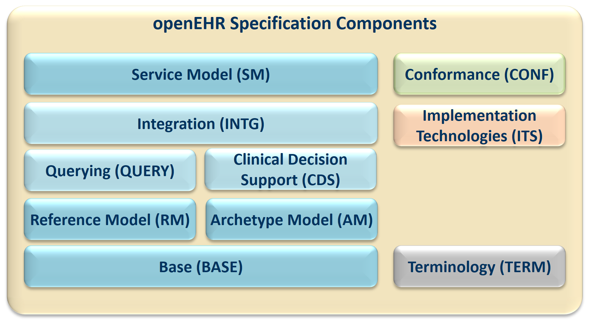

= Overview

This document provides an overview of the openEHR architecture. It commences with a description
of the specification project, followed by an overview of the reference model structure and packages.
Key global semantics including security, archetyping, identification, version and paths are then
described. The relationship to published standards is indicated, and finally, the approach to building
Implementation Technology Specifications (ITSs) is outlined.

== The openEHR Specification Project

FIGURE 1 illustrates the openEHR Specification Project. This project is responsible for developing
the specifications on which the openEHR Health Computing Platform is based. The relationships
between the parts of the computing platform and the specifications are indicated on the diagram. The
project deliverables include requirements, abstract specifications, implementation technology specifications
(ITSs), computable expressions and conformance criteria.

[.text-center]
.The openEHR Specification project

The abstract specifications consist of the Reference Model (RM), the Service Model (SM) and Archetype
Model (AM). The first two correspond to the ISO RM/ODP information and computational
viewpoints respectively. The latter formalises the bridge between information models and knowledge
resources.

The abstract specifications published by openEHR are defined using the UML notation and formal
textual class specifications. These models constitute the primary references for all openEHR semantics.
The presentation style of these abstract specifications is deliberately intended to be clear and
semantically close to the ideas being communicated. Accordingly, the specifications do not follow
idioms or limitations of particular programming languages, schema languages or other formalisms.

The specifications are also available in a tool-oriented computable UML format in order to
enable development of software and systems. The computable expressions for all practical purposes
can be assumed as being a lossless rendition of the published abstract specifications.

The implementation technology specifications on the other hand correspond to the expression of
abstract specifications in various programming and schema languages, each of which represents an
imperfect and usually partial transformation from the specification models. There are numerous
implementation technologies, ranging from programming languages, serial formalisms such as XML,
to database and distributed object interfaces. Each of these has its own limits and strengths. The
approach to implementing any of the openEHR abstract models in a given implementation technology
is to firstly define an ITS for the particular technology, then to use it to formally map the abstract
models into expressions in that technology.