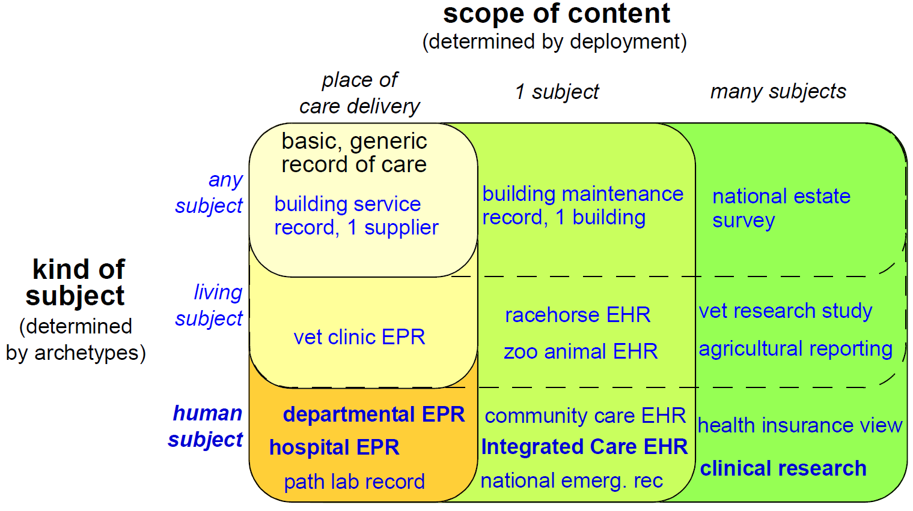
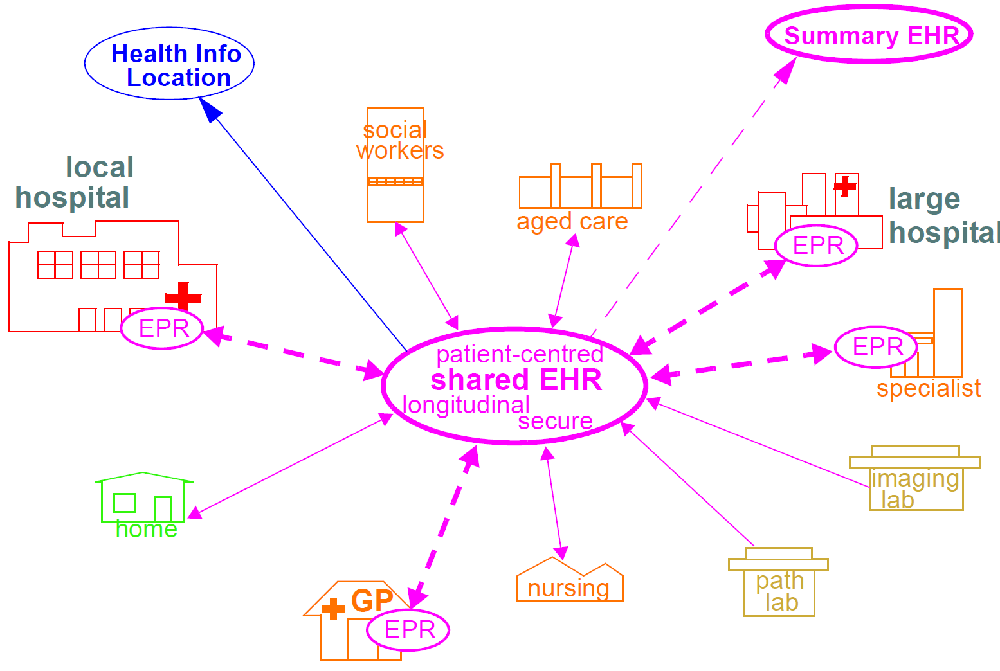

= Aims of the openEHR Architecture

== Overview

This section provides a brief overview of the requirements underpinning the openEHR architecture.
The openEHR architecture embodies 15 years of research from numerous projects and standards from
around the world. It has been designed based on requirements captured over many years.

Because the architecture is highly generic, and particularly due to being archetype-driven, it satisfies
many requirements outside the original concept of the "clinical EHR". For example, the same reference
architecture can be used for veterinary health or even "care" of public infrastructure or listed
buildings. This is due to the fact that the reference model embodies only concepts relating to "service
and administrative events relating to a subject of care"; it is in archetypes and templates that specifics
of the kinds of care events and subjects of care are defined. In another dimension, although one of the
requirements for the openEHR EHR was a "patient-centric, longitudinal, shared care EHR", it is not
limited to this, and can be used in purely episodic, specialist situations, e.g. as a radiology department
record system. Requirements for various flavours of "health care record" can be categorised according
to the two dimensions, scope, and kind of subject, as shown below.

[.text-center]
.Structure of Requirements met by openEHR

In this figure, each bubble represents a set of requirements, being a superset of all requirements of
bubbles contained within it. Requirements for a generic record of care for any kind of subject in a
local deployment are represented by the top left bubble. The subsequent addition of requirements corresponding
to living subjects and then human subjects is represented by the bubbles down the left side
of the diagram. The requirements represented by the largest bubble on the left hand side correspond to
"local health records for human care", such as radiology records, hospital EPRs and so on. Additional
sets of requirements represented by wider bubbles going across the diagram correspond to extending
the scope of the content of the care record first to a whole subject (resulting in a patient-centric, longitudinal
health record) and then to populations or cohorts of subjects, as done in population health and
research. From the (human) healthcare point of view, the important requirements groups extend all
the way to the bottom row of the diagram.

Going down the diagram, requirements corresponding to increasing specificity of subject of care
(from "any" to "human") are mostly implemented in openEHR by the use of archetypes. Going across
the diagram, the requirements corresponding to increasing scope of record content (from episodic to
population) are mainly expressed in different deployments, generally going from standalone to a
shared interoperable form. One of the key aspirations for EHRs today is the "integrated care record" 
sought by many health authorities today (see <<ISO_20514>> for definition of ICEHR), which provides an informational framework for integrated
shared care.

As a result of the approach taken by openEHR, components and applications built to satisfy the
requirements of an integrated shared care record can also be deployed as (for example) an episodic
radiology record system.

Some of the key requirements developed during the evolution of GEHR to openEHR are listed in the
following sections, corresponding to some of the major requirements groups of the figure <<scope_of_openehr>>.

=== Generic Care Record Requirements

The openEHR requirements include the following, corresponding to a basic, generic record of care:

* prioritisation of the patient / carer interaction (over e.g. research use of the record);
* suitable for all care settings (primary, acute etc.);
* medico-legal faithfulness, traceability, audit-trailing;
* technology & data format independence;
* highly maintainable and flexible software;
* support for clinical data structures: lists, tables, time-series, including point and interval events.

=== Health Care Record (EPR)

The following requirements addressed in openEHR correspond to a local health record, or EPR:

* support for all aspects of pathology data, including normal ranges, alternative systems of units etc.;
* supports all natural languages, as well as translations between languages in the record;
* integrates with any/multiple terminologies.

=== Shared Care EHR

The following requirements addressed in openEHR correspond to an integrated shared care EHR:

* support for patient privacy, including anonymous EHRs;
* facilitate sharing of EHRs via interoperability at data and knowledge levels;
* compatibility with CEN 13606, Corbamed, and messaging systems;
* support semi-automated and automated distributed workflows.

== Clinical Aims

From a more specifically clinical care perspective (rather than a record-keeping perspective), the following requirements have been identified during the development of openEHR:

* The need for a patient-centric, lifelong electronic health record that entails a holistic view of patient needs as opposed to niche problem-solving and decision-support techniques for limited diagnostic purposes;
* Integration of different views of the patient (GP, emergency and acute care, pathology, radiology, computerised patient-order entry, etc.) with the vast body of available knowledge resources (terminologies, clinical guidelines and computerised libraries);
* Clinical decision-support to improve patient safety and reduced costs through repeated medical investigations;
* Access to standards-based computing applications.

The Integrated Care EHR holds great promise: to generalise and make widely available the benefits
of computerisation that have been demonstrated individually and in isolated settings. These can be
summarised as:

* Reducing adverse events arising from medication errors such as interactions, duplications or inappropriate treatments and the flow-on costs associated with these;
* Improving the timely access to critical information and reduced clinician time searching for information;
* Reducing the incidence of patients being overlooked in the healthcare system due to information not being communicated;
* Reducing the duplication of investigations and other tests and procedures due to results not being available in the local computing environment;
* Improved prevention and early detection, based on predictive risk factor analysis, which is possible with quality EHR data;
* Improved decision making through decision support tools with access to the patient’s whole EHR;
* Improving access to and computation of evidence based guidelines;
* Increasing targeted health initiatives known to be effective, based on patient criteria; and
* Reduced hospitalisations and readmissions.

One comprehensive statement of EHR requirements covering many of the above is the ISO Technical
Report 18308 <<ISO_18308>> for which an openEHR profile has been created <<openehr_18308>>. The requirements summarised above
are described in more detail in the openEHR EHR Information Model document.

== Deployment Environments

Ultimately any software and information architecture only provides utility when deployed. The architecture
of openEHR is designed to support the construction of a number of types of system. One of
the most important, the integrated shared care health record is illustrated in the figure below.

[.text-center]
.Community Shared-care Context

In this form, the openEHR services are added to the existing IT infrastructure to provide a shared,
secure health record for patients that are seen by any number of health providers in their community
context. openEHR-enabled systems can also be used to provide EMR/EPR functionality at provider
locations. Overall, a number of important categories of system can be implemented using openEHR
including the following:

* shared-care community or regional health service EHRs;
* summary EHRs at a national, state, province or similar level;
* small desktop GP systems;
* hospital EMRs;
* consolidated and summary EHRs in federation environments;
* legacy data purification and validation gateways;
* web-based secure EHR systems for mobile patients.

