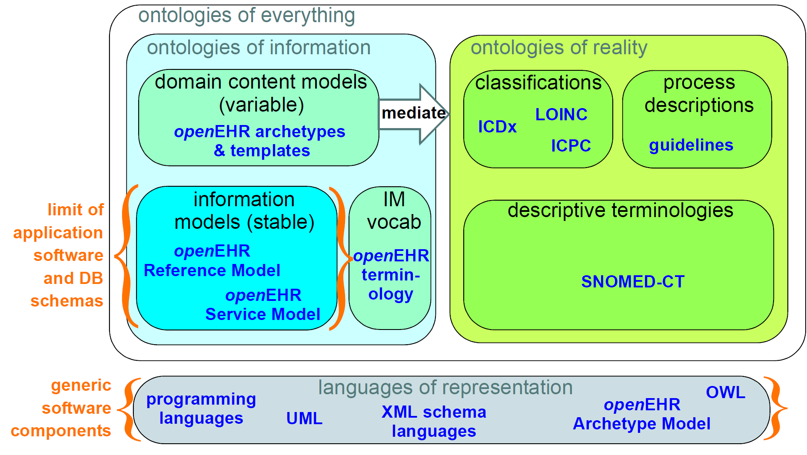
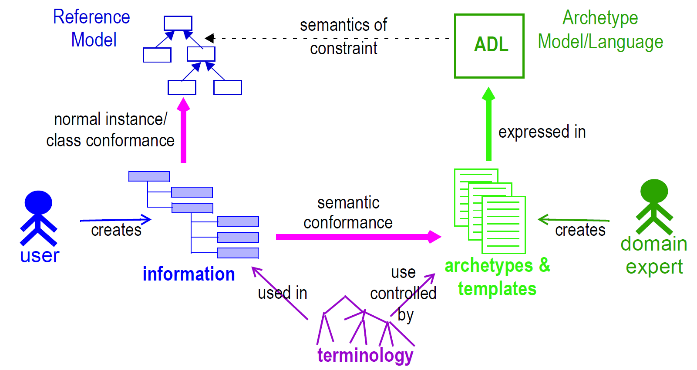
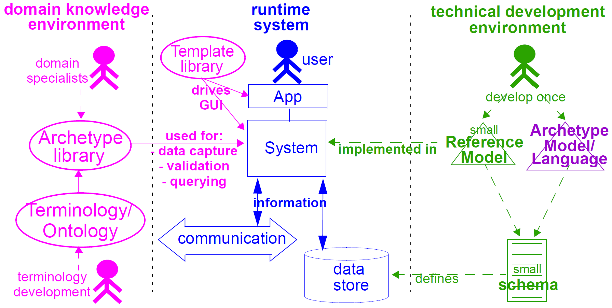
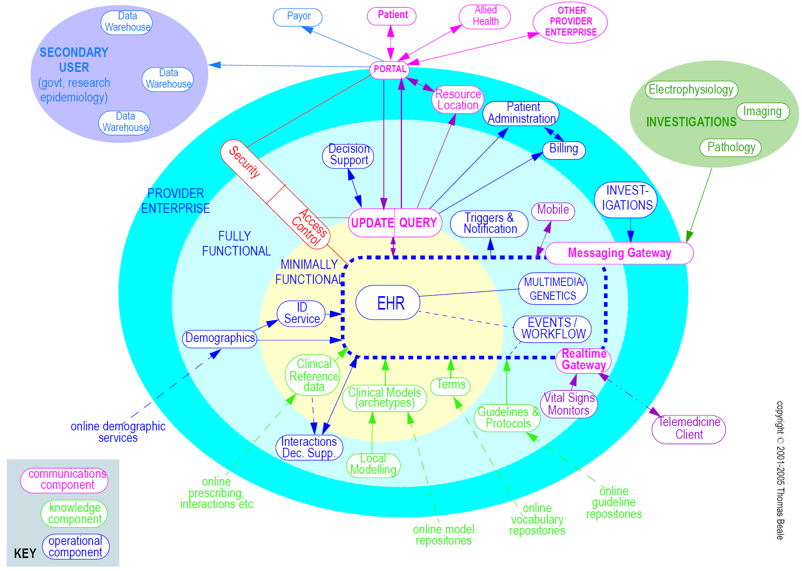

= Design Principles

The openEHR approach to modelling information, services and domain knowledge is based on a
number of design principles, described below. The application of these principles lead to a separation
of the models of the openEHR architecture, and consequently, a high level of componentisation. This
leads to better maintainability, extensibility, and flexible deployment.

== Ontological Separation

The most basic kind of distinction in any system of models is ontological, i.e. in the levels of abstraction
of description of the real world. All models carry some kind of semantic content, but not all
semantics are the same, or even of the same category. For example, some part of the SNOMED-CT <<SNOMED_CT>>
terminology describes types of bacterial infection, sites in the body, and symptoms. An information
model might specify a logical type Quantity. A content model might define the model of information
collected in an ante-natal examination by a physician. These types of "information" are qualitatively
different, and need to be developed and maintained separately within the overall model eco-system.
The figure below illustrates these distinctions, and indicates what parts are built directly into software and
databases.

[.text-center]
.The Ontological Landscape

This figure shows a primary separation between "ontologies of information" i.e. models of information
content, and "ontologies of reality" i.e. descriptions and classifications of real phenomena. These
two categories have to be separated because the type of authors, the representation and the purposes
are completely different. In health informatics, this separation already exists by and large, due to the
development of terminologies and classifications.

A secondary ontological separation within the information side is shown between information models
and domain content models. The former category corresponds to semantics that are _invariant_ across
the domain (e.g. basic data types like coded terms, data structures like lists, identifiers), while the latter
corresponds to _variable_ domain level content descriptions - descriptions of information structures
such as "microbiology result" rather than descriptions of actual phenomena in the real world (such as
infection by a microbe). This separation is not generally well understood, and historically, a great deal
of domain-level semantics has been hard-wired into the software and databases, leading to relatively
unmaintainable systems.

By clearly separating the three categories - information models, domain content models, and terminologies
- the openEHR architecture enables each to have a well-defined, limited scope and clear
interfaces. This limits the dependence of each on the other, leading to more maintainable and adaptable
systems.

=== Two-level Modelling and Archetypes

One of the key paradigms on which openEHR is based is known as "two-level" modelling, described
in <<Beale_2000>>. Under the two-level approach, a stable reference information model constitutes the first level
of modelling, while formal definitions of clinical content in the form of archetypes and templates constitute
the second. Only the first level (the Reference Model) is implemented in software, significantly
reducing the dependency of deployed systems and data on variable content definitions. The only other
parts of the model universe implemented in software are highly stable languages/models of representation
(shown at the bottom of the figure <<ontological_landscape>>). As a consequence, systems have the possibility of being
far smaller and more maintainable than single-level systems. They are also inherently self-adapting,
since they are built to consume archetypes and templates as they are developed into the future.

Archetypes and templates also act as a well-defined semantic gateway to terminologies, classifications
and computerised clinical guidelines. The alternative in the past has been to try to make systems
function solely with a combination of hard-wired software and terminology. This approach is flawed,
since terminologies don’t contain definitions of domain content (e.g. "microbiology result"), but
rather facts about the real world (e.g. kinds of microbes and the effects of infection in humans).

The use of archetyping in openEHR engenders new relationships between information and models, as
shown in the following figure.

[.text-center]
.Archetype Meta-architecture

In this figure, "data" as we know it in normal information systems (shown on the bottom left) conforms
in the usual way to an object model (top left). Systems engineered in the "classic" way (i.e. all
domain semantics are encoded somewhere in the software or database) are limited to this kind of
architecture. With the use of two-level modelling, runtime data now conform semantically to archetypes
as well as concretely to the reference model. All archetypes are expressed in a generic Archetype
Definition Language (ADL).

The details of how archetypes and templates work in openEHR are described in the section <<Archetypes and Templates>>.

=== Consequences for Software Engineering
Two-level modelling significantly changes the dynamics of the systems development process. In the
usual IT-intensive process, requirements are gathered via ad hoc discussions with users (typically via
the well-known "use case" methodology), designs and models built from the requirements, implementation
proceeds from the design, followed by testing and deployment and ultimately the maintenance
part of the lifecycle. This is usually characterised by ongoing high costs of implementation
change and/or a widening gap between system capabilities and the requirements at any moment. The
approach also suffers from the fact that ad hoc conversations with systems users nearly always fails to
reveal underlying content and workflow. Under the two-level paradigm, the core part of the system is
based on the reference and archetype models (includes generic logic for storage, querying, caching
etc.), both of which are extremely stable, while domain semantics are mostly delegated to domain
specialists who work building archetypes (reusable), templates (local use) and terminology (general
use). The process is illustrated in the following figure. Within this process, IT developers concentrate on
generic components such as data management and interoperability, while groups of domain experts
work outside the software development process, generating definitions that are used by systems at
runtime.

[.text-center]
.Two-level Software Engineering

Clearly applications cannot always be totally generic (although many data capture and viewing applications
are); decision support, administrative, scheduling and many other applications still require
custom engineering. However, all such applications can now rely on an archetype- and templatedriven
computing platform. A key result of this approach is that archetypes now constitute a technology-
independent, single-source expression of domain semantics, used to drive database schemas,
software logic, GUI screen definitions, message schemas and all other technical expressions of the
semantics.

== Separation of Responsibilities

A second key design paradigm used in openEHR is that of separation of responsibilities within the
computing environment. Complex domains are only tractable if the functionality is first partitioned
into broad areas of interest, i.e. into a "system of systems" [6]. This principle has been understood in
computer science for a long time under the rubrics "low coupling", "encapsulation" and "componentisation",
and has resulted in highly successful frameworks and standards, including the OMG’s
CORBA specifications and the explosion of object-oriented languages, libraries and frameworks.
Each area of functionality forms a focal point for a set of models formally describing that area, which,
taken together usually correspond to a distinct information system or service.

The following illustrates a notional health information environment containing numerous services, each
denoted by a bubble. Typical connections are indicated by lines, and bubbles closer to the centre correspond
to services closer to the core needs of clinical care delivery, such as the EHR, terminology,
demographics/identification and medical reference data. Of the services shown on the diagram,
openEHR currently provides specifications only for the more central ones, including EHR and Demographics.

[.text-center]
.A Health Information Environment

Since there are standards available for some aspects of many services, such as terminology, image
formats, messages, EHR Extracts, service-based interoperation, and numerous standards for details
such as date/time formats and string encoding, the openEHR specifications often act as a mechanism
to integrate existing standards.

== Separation of Viewpoints

The third computing paradigm used in openEHR is a natural consequence of the separation of responsibilities,
namely the separation of viewpoints. When responsibilities are divided up among distinct
components, it becomes necessary to define a) the information that each processes, and b) how they
will communicate. These two aspects of models constitute the two central "viewpoints" of the ISO
RM/ODP model [4], marked in bold in the following:

[horizontal]
Enterprise:: concerned with the business activities, i.e. purpose, scope and policies of the specified system.
Information:: concerned with the semantics of information that needs to be stored and processed in the system.
Computational:: concerned with the description of the system as a set of objects that interact at interfaces - enabling system distribution.
Engineering:: concerned with the mechanisms supporting system distribution.
Technological:: concerned with the detail of the components from which the distributed system is constructed.

The openEHR specifications accordingly include an information viewpoint - the openEHR Reference
Model - and a computational viewpoint - the openEHR Service Model. The Engineering viewpoint
corresponds to the Implementation Technology Specification (ITS) models of openEHR (see <<Implementation Technology Specifications>>), while the Technological viewpoint corresponds to
the technologies and components used in an actual deployment. An important aspect of the division
into viewpoints is that there is generally not a 1:1 relationship between model specifications in each
viewpoint. For example, there might be a concept of "health mandate" (a CEN ENV13940 Continuity
of Care concept) in the enterprise viewpoint. In the information viewpoint, this might have become a
model containing many classes. In the computational viewpoint, the information structures defined in
the information viewpoint are likely to recur in multiple services, and there may or may not be a
"health mandate" service. The granularity of services defined in the computational viewpoint corresponds
most strongly to divisions of function in an enterprise or region, while the granularity of components
in the information view points corresponds to the granularity of mental concepts in the
problem space, the latter almost always being more fine-grained.