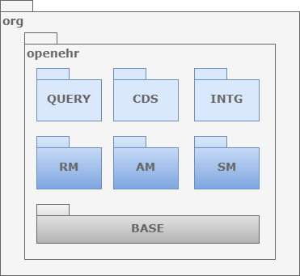
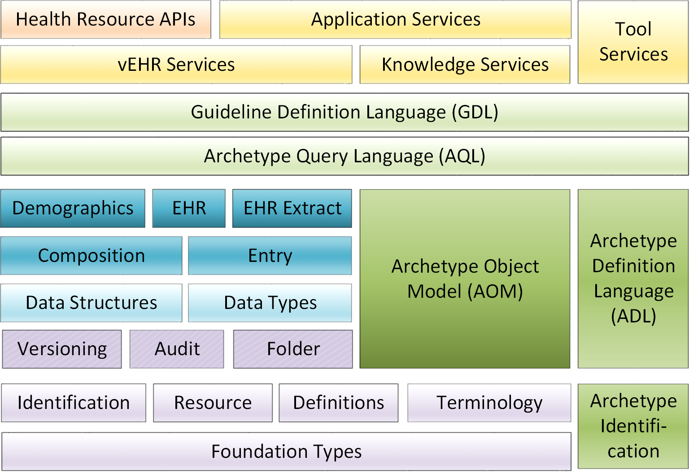
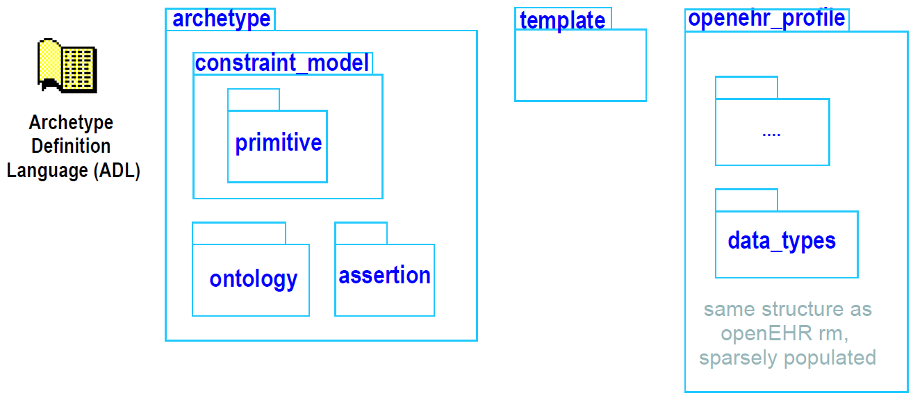
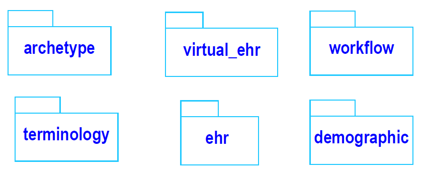

= openEHR Package Structure

== Overview

The following figure illustrates the package structure of the openEHR formal specifications. Three major packages
are defined: rm, am and sm. All packages defining detailed models appear inside one of these
outer packages, which may also be thought of as namespaces. They are conceptually defined within
the org.openehr namespace, which can be represented in UML as further packages. In some implementation
technologies (e.g. Java), the `org.openehr` namespace may actually be used within program
texts.

[.text-center]
.Global Package Structure of openEHR

One of the important design aims of openEHR is to provide a coherent, consistent and re-usable type
system for scientific and health computing. Accordingly, the ‘core’ of the RM (bottom-most layers)
provides identifiers, data types, data structures and various common design patterns that can be reused
ubiquitously in the upper layers of the RM, and equally in the AM and SM packages. The figure below
illustrates the relationships between the key packages. Dependencies only exist from higher packages to
lower packages.

[.text-center]
.openEHR Package Structure

== Reference Model (RM)

Each package defines a local context for definition of classes. The figure below illustrates the RM package
structure. An informal division into "domain", "patterns" and "core" is shown. The packages in the
latter group are generic, and are used by all openEHR models, in all the outer packages. Together,
they provide identification, access to knowledge resources, data types and structures, versioning
semantics, and support for archetyping. The packages in the former group define the semantics of
enterprise level health information types, including the EHR and demographics.

[.text-center]
.Structure of org.openehr.rm package
image::{uml_export_dir}/diagrams/RM-packages.svg[id=rm_packages, align="center"]

Each outer package in the figure <<rm_packages>> corresponds to one openEHR specification document (with the exception of the EHR and Composition packages, which are both described in the EHR Reference
Model document), documenting
an "information model" (IM). The package structure will normally be replicated in all ITS expressions,
e.g. XML schema, programming languages like Java, C# and Eiffel, and interoperability
definitions like WSDL, IDL and .Net.

=== Package Overview

The following sub-sections provide a brief overview of the RM packages.

==== Support Information Model
This package describes the most basic concepts, required by all other packages, and is comprised of
the `definitions`, `identification`, `terminology` and `measurement` packages. The semantics defined in
these packages allow all other models to use identifiers and to have access to knowledge services like
terminology and other reference data. The support package includes the special package
`assumed_types`, describing what basic types are assumed by openEHR in external type systems;
this package is a guide for integrating openEHR models proper into the type systems of implementation
technologies.

==== Data Types Information Model
A set of clearly defined data types underlies all other models, and provides a number of general and
clinically specific types required for all kinds of health information. The following categories of data
types are defined in the data types reference model.

[horizontal]
Text:: plain text, coded text, paragraphs.
Quantities:: any ordered type including ordinal values (used for representing symbolic ordered values such as pass:["+", "++", "+++"]), measured quantities with values and units, and so on.
Date/times:: date, time, date-time types, and partial date/time types.
Encapsulated data:: multimedia, parsable content.
Basic types:: boolean, state variable.

==== Data Structures Information Model
In most openEHR information models, generic data structures are used for expressing content whose
particular structure will be defined by archetypes. The generic structures are as follows.

[horizontal]
Single:: single items, used to contain any single value, such as a height or weight.
List:: linear lists of named items, such as many pathology test results.
Table:: tabular data, including unlimited and limited length tables with named and ordered columns, and potentially named rows.
Tree:: tree-shaped data, which may be conceptually a list of lists, or other deep structure.
History:: time-series structures, where each time-point can be an entire data structure of any complexity, described by one of the above structure types. Point and interval samples are supported.

==== Common Information Model
Several concepts recur in higher level packages. The classes `LOCATABLE` and `ARCHETYPED` provide
the link between information and archetype models. The classes `ATTESTATION` and `PARTICIPATION`
are generic domain concepts that appear in various reference models. The change_control
package defines a formal model of change management and versioning which applies to any service
that needs to be able to supply previous states of its information, in particular the demographic and
EHR services. The key semantics of versioning in openEHR are described in the <<Versioning>> section.

==== Security Information Model
The Security Information Model defines the semantics of access control and privacy setting for information
in the EHR.

==== EHR Information Model
The EHR IM defines the containment and context semantics of the concepts `EHR`, `COMPOSITION`,
`SECTION`, and `ENTRY`. These classes are the major coarse-grained components of the EHR, and correspond
directly to the classes of the same names in CEN EN13606:2005 and fairly closely to the "levels"
of the same names in the HL7 Clinical Document Architecture (CDA) release 2.0.
EHR Extract Information Model

The EHR Extract IM defines how an EHR extract is built from `COMPOSITIONs`, demographic, and
access control information from the EHR. A number of Extract variations are supported, including
"full openEHR", a simplified form for integration with CEN EN13606, and an openEHR/openEHR
synchronisation Extract.

==== Integration Information Model
The Integration model defines the class `GENERIC_ENTRY`, a subtype of `ENTRY` used to represent freeform
legacy or external data as a tree. This Entry type has its own archetypes, known as "integration
archetypes", which can be used in concert with clinical archetypes as the basis for a tool-based data
integration system. See <<Integrating openEHR with other Systems>> for more details.

==== Demographics Information Model
The demographic model defines generic concepts of `PARTY`, `ROLE` and related details such as contact
addresses. The archetype model defines the semantics of constraint on `PARTYs`, allowing archetypes
for any type of person, organisation, role and role relationship to be described. This approach provides
a flexible way of including the arbitrary demographic attributes allowed in the OMG HDTF
PIDS standard <<Corbamed_PIDS>>.

==== Workflow Information Model (future)
Workflow is the dynamic side of clinical care, and consists of models to describe the semantics of
processes, such as recalls, as well as any care process resulting from execution of guidelines.

== Archetype Model (AM)

The openEHR am package contains the models necessary to describe the semantics of archetypes and
templates, and their use within openEHR. These include ADL, the Archetype Definition Language
(expressed in the form of a syntax specification), the `archetype` and `template` packages, defining
the object-oriented semantics of archetypes and templates, and the `openehr_profile` package,
which defines a profile of the generic archetype model defined in the archetype package, for use in
openEHR (and other health computing endeavours). The internal structure of the `am` package is
shown below.

[.text-center]
.Structure of the org.openehr.am package

== Service Model (SM)

The openEHR service model includes definitions of basic services in the health information environment,
centred around the EHR. It is illustrated in the figure below. The set of services actually included
will undoubtedly evolve over time, so this diagram should not be seen as definitive.

[.text-center]
.Structure of the org.openehr.sm package

=== Virtual EHR API
The virtual EHR API defines the fine-grained interface to EHR data, at the level of Compositions and
below. It allows an application to create new EHR information, and to request parts of an existing
EHR and modify them. This API enables fine-grained archetype-mediated data manipulation.
Changes to the EHR are committed via the EHR service.

=== EHR Service Model
The EHR service model defines the coarse-grained interface to electronic health record service. The
level of granularity is openEHR Contributions and Compositions, i.e. a version-control / change-set
interface.

Part of the model defines the semantics of server-side querying, i.e. queries which cause large
amounts of data to be processed, generally returning small aggregated answers, such as averages, or
sets of ids of patients matching a particular criterion.

=== Archetype Service Model
The archetype service model defines the interface to online repositories of archetypes, and can be
used both by GUI applications designed for human browsing as well as access by other software services
such as the EHR.

=== Terminology Interface Model
The terminology interface service provides the means for all other services to access any terminology
available in the health information environment, including basic classification vocabularies such as
ICDx and ICPC, as well as more advanced ontology-based terminologies. Following the concept of
division of responsibilities in a system-of-systems context, the terminology interface abstracts the different underlying architectures of each terminology, allowing other services in the environment to
access terms in a standard way. The terminology service is thus the gateway to all ontology- and terminology-
based knowledge services in the environment, which along with services for accessing
guidelines, drug data and other "reference data" enables inferencing and decision support to be carried
out in the environment.
