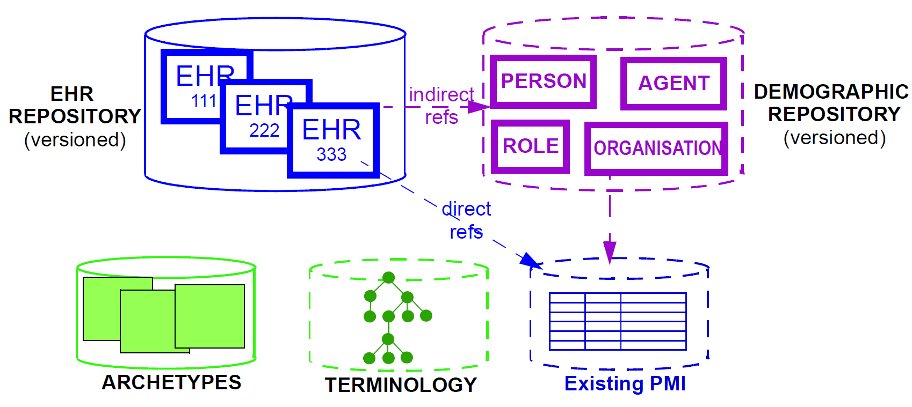
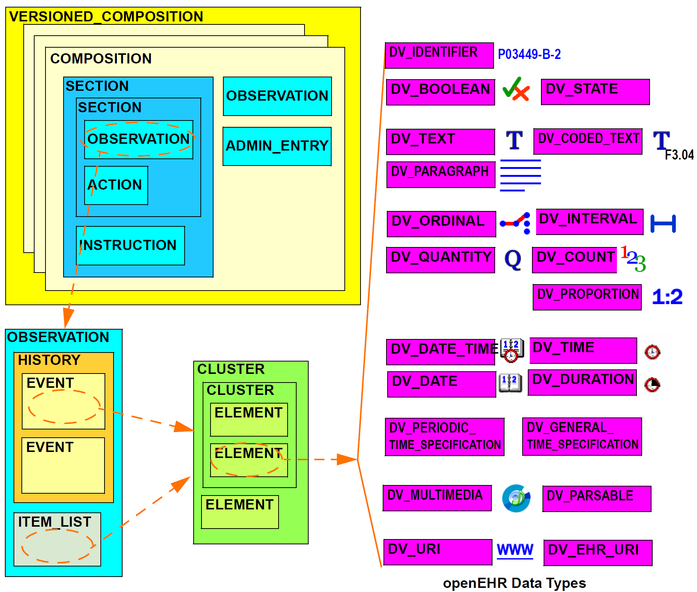
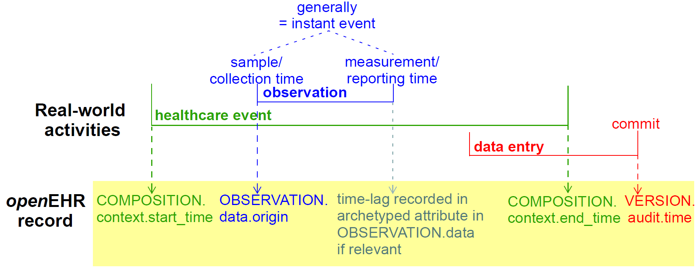

= Design of the openEHR EHR

== The EHR System

In informational terms, a minimal EHR system based on openEHR consists of an EHR repository, an archetype repository, terminology (if available), and demographic/identity information, as shown below.

[.text-center]
.Minimal openEHR EHR System

The latter may be in the form of an existing PMI (patient master index) or other directory, or it may be
in the form of an openEHR demographic repository. An openEHR demographic repository can act as
a front end to an existing PMI or in its own right. Either way it performs two functions: standardisation
of demographic information structures and versioning. An openEHR EHR contains references to
entities in whichever demographic repository has been configured for use in the environment; the
EHR can be configured to include either no demographic or some identifying data. One of the basic
principles of openEHR is the complete separation of EHR and demographic information, such that an
EHR taken in isolation contains little or no clue as to the identity of the patient it belongs to. The
security benefits are described below. In more complete EHR systems, numerous other services (particularly
security-related) would normally be deployed, as shown in figure <<health_information_environment>>.

== Top-level Information Structures

As has been shown, the openEHR information models define information at varying levels of granularity.
Fine-grained structures defined in the Support and Data types are used in the Data Structures
and Common models; these are used in turn in the EHR, EHR Extract, Demographic and other “toplevel”
models. These latter models define the “top-level structures” of openEHR, i.e. content structures
that can sensibly stand alone, and may be considered the equivalent of separate documents in a
document-oriented system. In openEHR information systems, it is generally the top-level structures
that are of direct interest to users. The major top-level structures include the following:

[horizontal]
Composition:: the committal unit of the EHR (see type `COMPOSITION` in EHR IM);
EHR Access:: the EHR-wide access control object (see type `EHR_ACCESS` in EHR IM);
EHR Status:: the status summary of the EHR (see type `EHR_STATUS` in EHR IM);
Folder hierarchy:: act as directory structures in EHR, Demographic services (see type FOLDER in Common IM);
Party:: various subtypes including `ACTOR`, `ROLE`, etc. representing a demographic entity with identity and contact details (see type `PARTY` and subtypes in Demographic IM);
EHR Extract:: the transmission unit between EHR systems, containing a serialisation of EHR, demographic and other content (see type `EHR_EXTRACT` in EHR Extract IM).

All persistent openEHR EHR, demographic and related content is found within top-level information
structures. Most of these are visible in the following figures.

== The EHR

The openEHR EHR is structured according to a relatively simple model. A central EHR object identified
by an EHR id specifies references to a number of types of structured, versioned information, plus
a list of Contribution objects that act as audits for changes made to the EHR. The high-level structure
of the openEHR EHR is shown below.

[.text-center]
.High-level Structure of the openEHR EHR
image::../ehr/diagrams/high_level_ehr_structure.png[high_level_ehr_structure,align="center",width="70%"]

In this figure, the parts of the EHR are as follows:

* _EHR_: the root object, identified by a globally unique EHR identifier;
* _EHR_access (versioned)_: an object containing access control settings for the record;
* _EHR_status (versioned)_: an object containing various status and control information, optionally including the identifier of the subject (i.e. patient) currently associated with the record;
* _Directory (versioned)_: an optional hierarchical structure of Folders that can be used to logically organise Compositions;
* _Compositions (versioned)_: the containers of all clinical and administrative content of the record;
* _Contributions_: the change-set records for every change made to the health record; each Contribution references a set of one or more Versions of any of the versioned items in the record that were committed or attested together by a user to an EHR system.

The internal structure of the Composition along with the Directory object correspond closely to the
levels in internationally agreed models of health information such as the CEN EN13606 and HL7
CDA standards.

The logical structure of a typical Composition is shown in more detail in the next figure. This shows various hierarchical levels from Composition to the data types are shown in a typical arrangement.
The 21 data types provide for all types of data needed for clinical and administrative recording.

[.text-center]
.Elements of an openEHR Composition

== Entries and “clinical statements”

=== Entry Subtypes

All clinical information created in the openEHR EHR is ultimately expressed in “Entries”. An Entry
is logically a single ‘clinical statement’, and may be a single short narrative phrase, but may also contain
a significant amount of data, e.g. an entire microbiology result, a psychiatric examination note, a
complex medication order. In terms of actual content, the Entry classes are the most important in the
openEHR EHR Information Model, since they define the semantics of all the ‘hard’ information in
the record. They are intended to be archetyped, and in fact, archetypes for Entries and sub-parts of
Entries make up the vast majority of archetypes defined for the EHR.

The openEHR `ENTRY` classes are shown below. There are five concrete subtypes:
`ADMIN_ENTRY`, `OBSERVATION`, `EVALUATION`, `INSTRUCTION` and `ACTION`, of which the latter four
are kinds of `CARE_ENTRY`.

[.text-center]
.The openEHR Entry model (in EHR IM)
image::{uml_export_dir}/diagrams/RM-composition.entry-simple.png[id=entry_model_simple, align="center",width="60%"]

The choice of these types is based on the clinical problem-solving process shown below.

[.text-center]
.Relationship of information types to the investigation process
image::../ehr/diagrams/clinical_investigator_process.png[clinical_investigator_process,align="center",width="80%"]

This figure shows the cycle of information creation due to an iterative, problem solving process typical
not just of clinical medicine but of science in general. The “system” as a whole is made up of two
parts: the “patient system” and the “clinical investigator system”. The latter consists of health carers,
and may include the patient (at points in time when the patient performs observational or therapeutic
activities), and is responsible for understanding the state of the patient system and delivering care to
it. A problem is solved by making observations, forming opinions (hypotheses), and prescribing
actions (instructions) for next steps, which may be further investigation, or may be interventions
designed to resolve the problem, and finally, executing the instructions (actions).

This process model is a synthesis of Lawrence Weed’s “problem-oriented” method of EHR recording,
and later related efforts, including the model of Rector, Nowlan & Kay <<Rector_1994>>, and the “hypothetico-deductive” model of reasoning (see e.g. <<Elstein_1987>>). However hypothesis-making and testing is not the only successful process used by clinical professionals - evidence shows that many (particularly those older
and more experienced) rely on pattern recognition and direct retrieval of plans used previously with
similar patients or prototype models. The investigator process model used in openEHR is compatible
with both cognitive approaches, since it does not say how opinions are formed, nor imply any specific
number or size of iterations to bring the process to a conclusion, nor even require all steps to be
present while iterating (e.g. GPs often prescribe without making a firm diagnosis). Consequently, the
openEHR Entry model does not impose a process model, it only provides the possible types of information
that might occur.

==== Ontology of Entry Types
In the clinical world practitioners do not think in terms of only five kinds of data corresponding to the
subtypes of Entry described above. There are many subtypes of each of these types, of which some
are shown in the figure below.

[.text-center]
.Ontology of Recorded Information
image::../ehr/diagrams/CIR_ontology.png[CIR_ontology,align="center",width="80%"]

The key top-level categories are ‘care information’ and ‘administrative information’. The former
encompasses all statements that might be recorded at any point during the care process, and consists
of the major sub-categories on which the Entry model is based, namely ‘observation’, ‘opinion’,
‘instruction’, and ‘action’ (a kind of observation) which themselves correspond to the past, present
and future in time. The administrative information category covers information which is not generated
by the care process proper, but relates to organising it, such as appointments and admissions.
This information is not about care, but about the logistics of care delivery.
Regardless of the diversity, each of the leaf-level categories shown in this figure is ultimately a subcategory
of one of the types from the process model, and hence, of the subtypes of the openEHR
Entry model.

Correct representation of the categories from the ontology is enabled by using archetypes designed to
express the information of interest (say a risk assessment) in terms of a particular Entry subtype (in
this case, Evaluation). In a system where Entries are thus modelled, there will be no danger of incorrectly
identifying the various kinds of Entries, as long as the Entry subtype, time, and certainty/negation are taken into account. 
Note that even if the ontology shown in the <<CIR_ontology>> figure is not correct (undoubtedly
it isn’t), archetypes will be constructed to account for each improved idea of what such categories
should really be.

==== Clinical Statement Status and Negation
A well-known problem in clinical information recording is the assignment of “status” to recorded
items. Kinds of status include variants like “actual value of P” (P stands for some phenomenon),
“family history of P”, “risk of P”, “fear of P”, as well as negation of any of these, i.e. “not/no P”, “no
history of P” etc. A proper analysis of these so called statuses shows that they are not “statuses” at all,
but different categories of information as per the ontology of figure <<CIR_ontology>>. In general, negations are
handled by using “exclusion” archetypes for the appropriate Entry type. For example, “no allergies”
can be modelled using an Evaluation archetype that describes which allergies are excluded for this
patient. Another set of statement types that can be confused in systems that do not properly model
information categories concern interventions, e.g. “hip replacement (5 years ago)”, “hip replacement
(recommended)”, “hip replacement (ordered for next tuesday 10 am)”.

All of these statement types map directly to one of the openEHR Entry types in an unambiguous fashion,
ensuring that querying of the EHR does not match incorrect data, such as a statement about fear
or risk, when the query was for an observation of the phenomenon in question.

Further details on the openEHR model clinical information are given in the EHR IM document, Entry
Section.

== Managing Interventions

A key part of the investigation process shown in figure <<clinical_investigator_process>>, and indeed healthcare in general, is
intervention. Specifying and managing interventions (whether the simplest prescriptions or complex
surgery and therapy) is a hard problem for information systems because it is in “future time” (meaning
that intervention activities have to be expressed using branching/looping time specifications, not
the simple linear time of observations), unexpected events can change things (e.g. patient reaction to
drugs), and the status of a given intervention can be hard to track, particularly in distributed systems.
However, from the health professional’s point of view, almost nothing is more basic than wanting to
find out: what medications is this patient on, since when, and what is the progress?
The openEHR approach to these challenges is to use the Entry type `INSTRUCTION`, its subpart
`ACTIVITY` to specify interventions in the future, and the Entry subtype `ACTION` to record what has
actually happened. A number of important features are provided in this model, including:

* a single, flexible way of modelling all interventions, whether they be single drug medication orders or complex hospital-based therapies;
* a way of knowing the state of any intervention, in terms of the states in a standard state machine, shown below; this allows a patient’s EHR to be queried in a standard way so as to return “all active medications”, “all suspended interventions” etc.;
* a way of mapping particular care process flow steps to the standard state machine states, enabling health professionals to define and view interventions in terms they understand;
* support for automated workflow, without requiring it.

Coupled with the comprehensive versioning capabilities of openEHR, the Instruction/Action design
allows clinical users of the record to define and manage interventions for the patient in a distributed
environment.

[.text-center]
.openEHR standard Instruction State Machine
image::../ehr/diagrams/instruction_state_machine.png[instruction_state_machine,align="center"]

== Time in the EHR

Time is well-known as a challenging modelling problem in health information. In openEHR, times
that are a by-product of the investigation process (e.g. time of sampling or collection; time of measurement,
time of a healthcare business event, time of data committal) described above are concretely
modelled, while other times specific to particular content (e.g. date of onset, date of resolution) are
modelled using archetyping of generic data attributes. The following figure shows a typical relationship
of times with respect to the observation process, and the corresponding attributes within the
openEHR reference model. Note that under different scenarios, such as GP consultation, radiology
reporting and others, the temporal relationships may be quite different than those shown in the figure.
Time is described in detail in the EHR Information Model <<openehr_rm_ehr>>.

[.text-center]
.Time in the EHR

== Language

In some situations, there may be more than one language used in the EHR. This may be due to
patients being treated across borders (common among the Scandinavian countries, between Brazil
and northern neighbours), or due to patients being treated while travelling, or due to multiple languages
simply being used in the home environment.

Language is handled as follows in the openEHR EHR. The default language for the whole EHR is
determined from the operating system locale. It may be included in the EHR_status object if desired.
Language is then mandatorily indicated in two places in the EHR data, namely in Compositions and
Entries (i.e. Observations, etc), in a language attribute. This allows both Compositions of different
languages in the EHR, and Entries of different languages in the same Composition. Additionally,
within Entries, text and coded text items may optionally have language recorded if it is different from
the language of the enclosing Entry, or where these types are used within other non-Entry structures
that don’t indicate language.

The use of these features is mostly likely to occur due to translation, although in some cases a truly
multi-lingual environment might exist within the clinical encounter context. In the former case, some
parts of an EHR, e.g. particular Compositions will be translated before or after a clinical encounter to
as to make the information available in the primary language of the EHR. The act of translation (like
any other interaction with the EHR) will cause changes to the record, in the form of new Versions.
New translations can conveniently be recorded as branch versions, attached to the version of which
they are a translation. This is not mandatory, but provides a convenient way to store translations so
that they don’t appear to replace the original content.