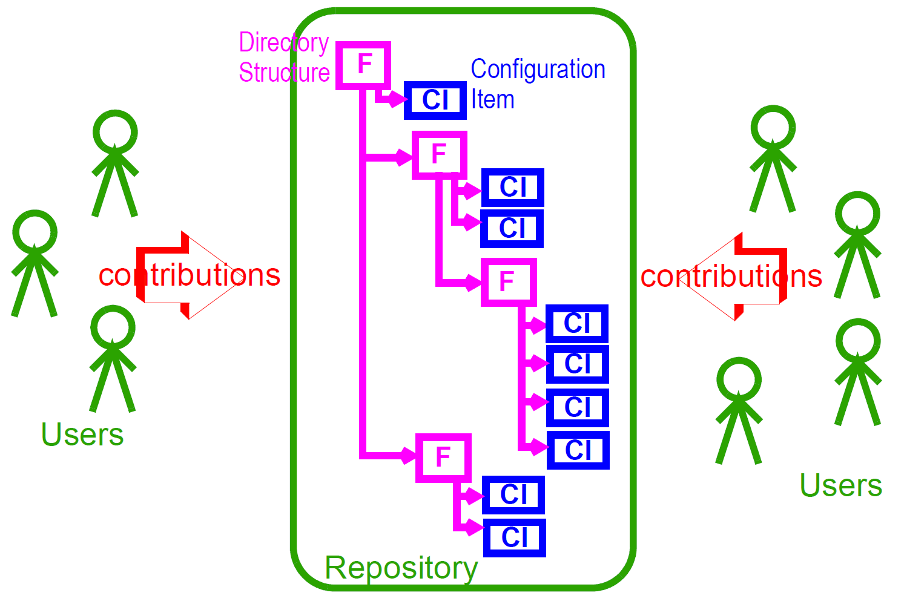
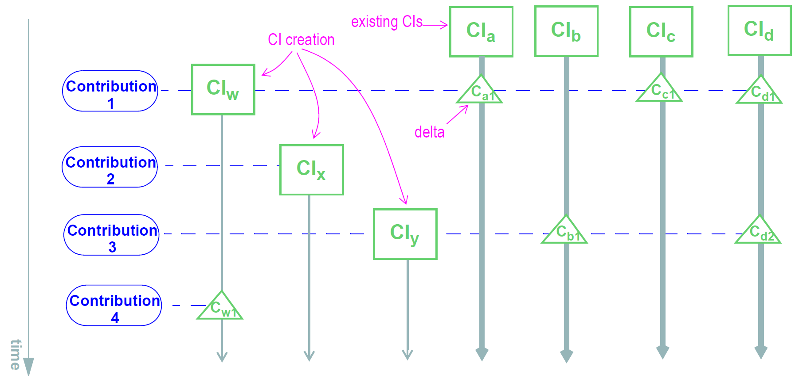
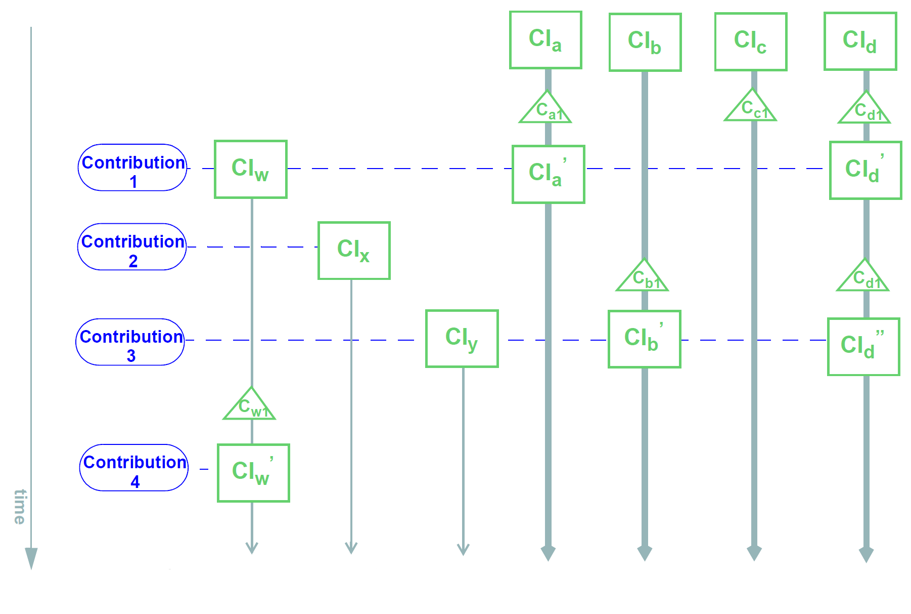
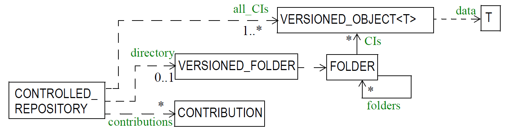

= Versioning

== Overview

Version control is an integral part of the openEHR architecture. An openEHR repository for EHR or
demographic information is managed as a change-controlled collection of “version containers” (modelled
by the `VERSIONED_OBJECT<T>` class in the `common.change_control` package), each containing
the versions of a top-level content structure (such as a Composition or Party) as it changes
over time. A version-controlled top-level content structure is visualised below.

[.text-center]
.Version Signature
image::../common/diagrams/version_control_structures.png[version_control_structures,align="center", width=80%]

Versioning of single top-level structures is a necessary, but not sufficient requirement for a repository
that must provide coherence, traceability, indelibility, rollback, and support for forensic examination
of past states of the data. Features supporting “change control” are also required. Under a disciplined
change control scheme, changes are not made arbitrarily to single top-level structures, but to the
repository itself. Changes take the form of change-sets, called “Contributions”, that consist of new or
changed versions of the controlled items in the repository. The key feature of a change-set is that it
acts like a transaction, and takes the repository from one consistent state to another, whereas arbitrary
combinations of changes to single controlled items could easily be inconsistent, and even dangerously
wrong where clinical data are concerned.

These concepts are well-known in configuration management (CM), and are used as the basis for
most software and other change management systems, including numerous free and commercial
products available today. They are a central design feature of openEHR architecture. The following
sections provide more details

== The Configuration Management Paradigm

The “configuration management” (CM) paradigm is well-known in software engineering, and has its
own IEEE standard <<IEEE_828>>. CM is about managed control of changes to a repository of items (formally
called “configuration items” or CIs), and is relevant to any logical repository of distinct information
items which changes in time. In health information systems, at least two types of information require
such management: electronic health records, and demographic information. In most analyses in the
past, the need for change management has been expressed in terms of specific requirements for audit
trailing of changes, availability of previous states of the repository and so on. In openEHR, the aim is
to provide a formal, general-purpose model for change control, and show how it applies to health
information.

=== Organisation of the Repository

The general organisation of a repository of complex information items such as a software repository,
or the EHR consists of the following:

* a number of distinct information items, or configuration items, each of which is uniquely identified, and may have any amount of internal complexity;
* optionally, a directory system of some kind, in which the configurations items are organised;
* other environmental information which may be relevant to correctly interpreting the primary versioned items, e.g. versions of tools used to create them.

In a software or document repository, the CIs are files arranged in the directories of the file system; in
an EHR based on openEHR, they are Compositions, the optional Folder structure, Parties in the
demographic service and so on. Contributions are made to the repository by users. This general
abstraction is visualised as follows.

[.text-center]
.General Structure of a Controlled Repository

=== Change Management

Change doesn’t occur to Configuration Items in isolation, but to the repository as a whole. Possible types of change include:

* creation of a new CI;
* removal of a CI;
* modification of a CI;
* creation of, change to or deletion of part of the directory structure;
* moving of a CI to another location in the directory structure;
* attestation of an existing CI.

The goal of configuration management is to ensure the following:

* the repository is always in a valid state;
* any previous state of the repository can be reconstructed;
* all changes are audit-trailed.

== Managing Changes in Time

Properly managing changes to the repository requires two mechanisms. The first, version control, is
used to manage versions of each CI, and of the directory structure if there is one. The second is the
concept of the “change-set”, known as a contribution in openEHR. This is the set of changes to individual
CIs (and other top-level structures in the EHR) made by a user as part of some logical change.
For example, in a document repository, the logical change might be an update to a document that consists
of multiple files (CIs). There is one Contribution, consisting of changes to the document file CIs,
to the repository. In the EHR, a Contribution might consist of changes to more than one Composition,
and possibly to the organising Folder structure. Any change to the EHR requires a Contribution. The
kinds of changes that can occur to items affected in a Contribution are:

* _addition of new item_: a new Version container is created and a first Version added to it;
* _deletion of item_: a new Version whose data attribute is set to Void is added to an existing Version container;
* _modification of item_: a new Version whose data contains the updated form of the item content is added to an existing Version container (this may be done for a logical update or correction);
* _import of item_: a new ‘import’ Version is created, incorporating the received Version;
* _attestation of item_: a new Attestation is added to the attestations list of an existing Version.

A typical sequence of changes to a repository is illustrated in the following figure.

[.text-center]
.Contributions to the Repository (delta form)

This shows the effect of four Contributions (indicated by blue ovals on the left hand side) to a repository
containing a number of CIs (the directory tree is not shown for the sake of simplicity). As each
Contribution is made, the repository is changed in some way. The first brings into existing a new CI,
and modifies three others (changes indicated by the ‘C’ triangles). The second Contribution causes
the creation of a new CI only. The third causes a creation as well as two changes, while the fourth
causes only a change. (Changes to the folder structure are not shown here).

One nuance which should be pointed out is that in the figure above Contributions are shown as if they are
literally a set of deltas, i.e. exactly the changes which occur to the record. Thus, the first Contribution
is the set {CI~w~, C~a1~, C~c1~, C~d1~} and so on. Whether this is literally true depends on the construction of
the persistence solution. In some situations, some CIs may be updated by the user viewing the current
list and entering just the changes - the situation shown above; in others, the system may provide
the current state of these CIs for editing by the user, and submit the updated versions, as shown
in the next figure. Some applications may do both, depending on which CI is being updated. The internal
versioning implementation may or may not generate deltas as a way of efficient storage.

[.text-center]
.Contributions to the Repository (non-delta form)

For the purposes of openEHR, a Contribution is considered as being the set of Versions created or
attested at one time, as implied by the figure above.

=== General Model of a Change-controlled Repository

The following figure shows an abstract model of a change-controlled repository.

[.text-center]
.Abstract Model of Change-controlled Repository

This consists of:

* version-controlled configuration items - instances of `VERSIONED_OBJECT<T>`;
* `CONTRIBUTIONs`;
* an optional directory system of folders. If folders are used, the folder structure must also be versioned as a unit.

The actual type of links between the controlled repository and the other entities might vary - in some
cases it might be association, in others aggregation; cardinalities might also vary. The figure above therefore provides a guide to the definition of actual controlled repositories, such as an EHR, rather than a
formal specification for them.

== The “Virtual Version Tree”

An underlying design concept of the versioning model defined in openEHR is known as a “virtual
version tree”. The idea is simple in the abstract. Information is committed to a repository (such as an
EHR) in lumps, each lump being the “data” of one Version. Each Version has its place within a version
tree, which in turn is maintained inside a Versioned object (or “version container”). The virtual
version tree concept means that any given Versioned object may have numerous copies in various
systems, and that the creation of versions in each is done in such a way that all versions so created are
in fact compatible with the “virtual” version tree resulting from the superimposition of the version
trees of all copies. This is achieved using simple rules for version identification and is done to facilitate
data sharing. Two very common scenarios are served by the virtual version tree concept:

* longitudinal data that stands as a proxy for the state or situation of the patient such as “Medications” or “Problem list” (persistent Compositions in openEHR) is created and maintained in one or more care delivery organisations, and shared across a larger number of organisations;
* some EHRs in an EHR server in one location are mirrored into one or more other EHR servers (e.g. at care providers where the relevant patients are also treated); the mirroring process requires asynchronous synchronisation between servers to work seamlessly, regardless of the location, time, or author of any data created.

The versioning scheme used in openEHR guarantees that no matter where data are created or copied,
there are no inconsistencies due to sharing, and that logical copies are explicitly represented. It therefore
provides direct support for shared data in a shared care context.

