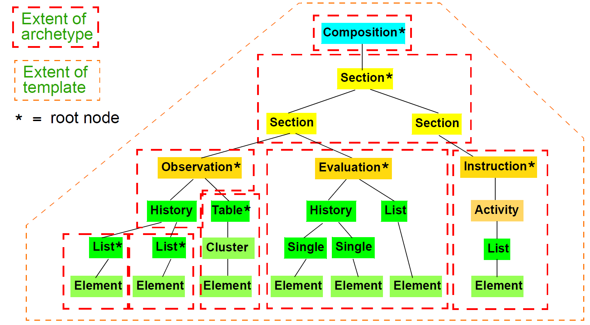
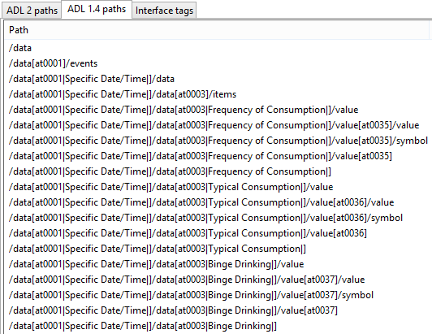
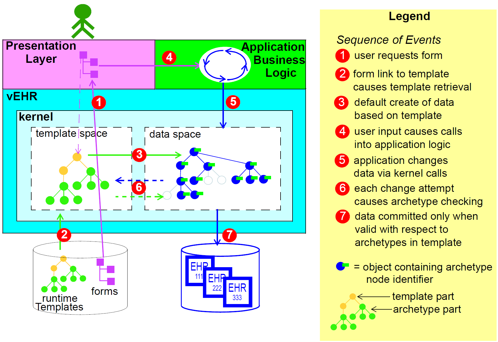

= Archetypes and Templates

== Overview

Under the two-level modelling approach, the formal definition of information structuring occurs at
two levels. The lower level is that of the reference model, a stable object model from which software
and data can be built. Concepts in the openEHR reference model are invariant, and include things like
Composition, Section, Observation, and various data types such as Quantity and Coded text. The
upper level consists of domain-level definitions in the form of archetypes and templates. Concepts
defined at this level include things such as "blood pressure measurement", "SOAP headings", and
"HbA1c Result".

All information conforming to the openEHR Reference Model (RM) - i.e. the collection of Information
Models (IMs) - is "archetypable", meaning that the creation and modification of the content, and
subsequent querying of data is controllable by archetypes. Archetypes are themselves separate from
the data, and are stored in their own repository. The archetype repository at any particular location
will usually include archetypes from well-known online archetype libraries. Archetypes are deployed
at runtime via templates that specify particular groups of archetypes to use for a particular purpose,
often corresponding to a screen form.

Archetypes are themselves instances of an archetype model, which defines a language in which to
write archetypes; the syntax equivalent of the model is the Archetype Definition Language, ADL.
These formalisms are specified in the openEHR Archetype Object Model (AOM) and ADL documents
respectively. Each archetype is a set of constraints on the reference model, defining a subset of
instances that are considered to conform to the subject of the archetype, e.g. "laboratory result". An
archetype can thus be thought of as being similar to a LEGO(R) instruction sheet (e.g. for a tractor) that
defines the configuration of LEGO(R) bricks making up a tractor. Archetypes are flexible; one archetype
includes many variations, in the same way that a LEGO(R) instruction might include a number of
options for the same basic object. Mathematically, an archetype is equivalent to a query in F-logic <<Kifer_Lausen_Wu_1995>>.

In terms of scope, archetypes are general-purpose, re-usable, and composable. For data capture and
validation purposes, they are usually used at runtime by templates.
An openEHR Template is a specification that defines a tree of of one or more archetypes, each constraining
instances of various reference model types, such as Composition, Section, Entry subtypes
and so on. Thus, while there are likely to be archetypes for such things as "biochemistry results" (an
Observation archetype) and "SOAP headings" (a Section archetype), templates are used to put archetypes
together to form whole Compositions in the EHR, e.g. for "discharge summary", "antenatal
exam" and so on. Templates usually correspond closely to screen forms, printed reports, and in general,
complete application-level lumps of information to be captured or sent; they may therefore be
used to define message content. They are generally developed and used locally, while archetypes are
usually widely used.

A template is used at runtime to create default data structures and to validate data input, ensuring that
all data in the EHR conform to the constraints defined in the archetypes referenced by the template. In
particular, it conforms to the path structure of the archetypes, as well as their terminological constraints.
Which archetypes were used at data creation time is written into the data, in the form of both
archetype identifiers at the relevant root nodes, and archetype node identifiers (the [atnnnn] codes),
which act as normative node names, and which are in turn the basis for paths. When it comes time to
modify the same data, these archetype node identifiers enable applications to retrieve and use the
original archetypes, ensuring modifications respect the original constraints.

Archetypes also form the basis of semantic querying. Queries are expressed in a language which is a
synthesis of SQL (SELECT/FROM/WHERE) and W3C XPaths, extracted from the archetypes.

== Archetype Formalisms and Models

=== Overview

In openEHR, archetypes are formalised by the Archetype Object Model (AOM). This is an object
model of the semantics of archetypes. When an archetype is represented in memory (for example in
an archetype-enabled EHR "kernel"), the archetype will exist as instances of the classes of this
model. The AOM is thus the definitive statement of the semantics of archetypes.

In serialised form, archetypes can be represented in various ways. The normative, abstract serialisation
in openEHR is Archetype Definition Language (ADL). This is an abstract language based on
Frame Logic queries with the addition of terminology. An ADL archetype
is a guaranteed 100% lossless rendering of the semantics of any archetype, and is designed to be a
syntactic analogue of the AOM. Nevertheless, other lossless and lossy serialisations are possible and
some already exist. For practical purposes, XML-based serialisations are used in some situations. A
serialisation purely expressed in dADL, the ADL object serialisation syntax will be available in the
future. Various HTML, RTF and other formats are used for screen rendering and human review.

openEHR Templates are represented as dADL documents whose object model conforms to the Template
Object Model (TOM).

=== Design-time Relationships between Archetypes

Archetypes are extensible formal constraint definitions of object structures. In common with object
model classes, they can be specialised, as well as composed (i.e. aggregated). Specialised archetypes
are created when an archetype is already available for the content that needs to be modelled, but it
lacks detail or is too general. For example, the archetype `openEHR-EHR-OBSERVATION.laboratory.v1` 
contains generic concepts of 'specimen', 'diagnostic service', a single result of any type,
and a two-level result battery for grouped results. This archetype could be (and has been) used to represent
nearly any kind of laboratory result data. However, specialisations such as `openEHR-EHROBSERVATION.laboratory-glucose.v1` 
are extremely useful, and can be easily defined based
on the predecessor; in this case, the single result node is redefined to be 'blood glucose'. The formal
rule for specialisation is that:

* a specialised archetype can only further narrow existing constraints in the parent (but it may add its own).

This has the effect that the data created with any specialised archetype will always be matched by
queries based on the parent archetype - in other words, a query for 'laboratory' Observations will correctly
retrieve 'glucose' Observations as well. This accords with the basic ontological principle of
subsumption, which says that instances of a type B are also instances of type A, where type B is
related to type A by the semantic relationship 'IS-A'. Specialised archetypes are indicated by the use
of an identifier derived from the parent archetype, with a new sub-element of the semantic part of the
identifier, separated by a '-' character.

The second relationship possible between archetypes is composition, allowing large data structures to
be flexibly constrained via the hierarchical re-use of smaller archetypes. Composition is defined in
terms of 'slots' within an archetype. A slot is a point in an archetype structure where, instead of specifying
an object type inline, a special allow_archetype constraint is used to specify other archetypes
constraining that same type, that may be used at that point. For example, the archetype `openEHR-EHR-SECTION.vital_signs.v1`
defines a heading structure for headings to do with vital signs. It
also defines as its items attribute value (i.e. what comes under the heading) a number of possible
Observations; however, rather than defining these inline, it specifies an archetype slot in the form of
constraints on Observation archetypes that are allowed at that point. The simplest kind of constraint is
in terms of regular expressions on archetype identifiers. More complex constraints can be stated in
terms of paths in other archetypes (for example `exists (/some/path[at0005])`). A slot thus
defines a 'chaining point' in terms of possible archetypes allowed or excluded at that point; limiting
this to a single archetype is of course possible. Templates are used to choose which particular archetypes
allowed at a slot will actually be used in a given circumstance.

== Relationship of Archetypes and Templates to Data

All nodes within the top-level information structures in the openEHR RM are "archetypable", with
certain nodes within those structures being archetype "root points". Each top-level type is always
guaranteed to be an archetype root point. Although it is theoretically possible to use a single archetype
for an entire top-level structure, in most cases, particularly for `COMPOSITION` and `PARTY`, a hierarchical
structure of multiple archetypes will be used, via the slot mechanism described above. This
allows for componentisation and reusability of archetypes. When hierarchies of archetypes are used
for a top-level structure, there will also be archetype root points in the interior of the structure. For
example, within a `COMPOSITION`, `ENTRY` instances (i.e. `OBSERVATIONs`, `EVALUATIONs` etc.) are
almost always root points. `SECTION` instances are root points if they are the top instance in a Section
structure; similarly for `FOLDER` instances within a directory structure. Other nodes (e.g. interior `SECTIONs`,
`ITEM_STRUCTURE` instances) might also be archetype root points, depending on how archetypes
are applied at runtime to data. The following figure illustrates the application of archetypes and
templates to data.

[.text-center]
.How Archetypes apply to Data

== Archetype-enabling of Reference Model Data

Archetype-enabling of Reference Model classes is achieved via inheritance of the class `LOCATABLE`
from the package `common.archetyped` (see Common IM). The `LOCATABLE` class includes the
attributes `_archetype_node_id_` and `_archetype_details_`. In the data, the former carries an identifier from
the archetype. If the node in the data is a root point, it carries the multipart identifier of the generating
archetype, and `_archetype_details_` carries an `ARCHETYPED object`, containing information pertinent to
archetype root points. If it is a non-root node, the `_archetype_node_id_` attribute carries the identifier
(known as an "at", or "archetype term" code) of the archetype interior node that generated the data
node, and the `_archetype_details_` attribute is void.

Sibling nodes in data can carry the same `_archetype_node_id_` in some cases, since archetypes provide a
pattern for data, rather than an exact template. In other words, depending on the archetype design, a
single archetype node may be replicated in the data.

In this way, each archetyped data composition in openEHR data has a generating archetype which
defines the particular configuration of instances to create the desired composition. An archetype for
"biochemistry results" is an `OBSERVATION` archetype, and constrains the particular arrangement of
instances beneath an `OBSERVATION` object; a "problem/SOAP headings" archetype constrains `SECTION`
objects forming a SOAP headings structure. In general, an archetyped data composition is any
composition of data starting at a root node and continuing to its leaf nodes, at which point lower-level
compositions, if they exist, begin. Each of the archetyped areas and its subordinate archetyped areas
in figure <<archetypes_and_data>> is an archetyped data composition.

NOTE: care must be taken not to confuse the general term "composition" with the specific use of this word in
openEHR and CEN EN 13606, defined by the `COMPOSITION` class; the specific use is always indicated by
using the term "Composition".

The result of the use of archetypes to create data in the EHR (and other systems) is that the structure
of data in any top-level object conforms to the constraints defined in a composition of archetypes chosen
by a template, including all optionality, value, and terminology constraints.

== Archetypes, Templates and Paths

The use of openEHR archetypes and templates enables paths to be used ubiquitously in the openEHR
architecture. Paths are extracted from Archetypes and templates, and are constructed from attribute
names and archetype node identifiers, in an Xpath-compatible syntax, as shown in the following figure.
These paths serve to identify any node in a template or archetype, such as the "diastolic blood pressure"
`ELEMENT` node, deep within a "blood pressure measurement" archetype. Since archetype node
identifiers are embedded into data at runtime, archetype paths can be used to extract data nodes conforming
to particular parts of archetypes, providing a very powerful basis for querying. Paths can also
be constructed into data, using more complex predicates (still in the Xpath style). Paths in openEHR
are explained in detail under Paths and Locators on page 57.

[.text-center]
.Paths extracted from an archetype

== Archetypes and Templates at Runtime

=== Overview

openEHR archetypes and templates were designed as formal artefacts, so as to be computable at runtime.
They perform two key functions. The first is to facilitate data validation at data capture or import
time, i.e. to guarantee that data conform to not just the reference model, but also to the archetypes
themselves. Data validation with archetypes is mediated by the use of openEHR Templates. The second
function is as a design basis for queries. Since data are captured based on archetypes, all
openEHR data are guaranteed to conform to the "semantic paths" that are created by the composition
of archetypes within a template. The paths (such as those shown in figure <<archetype_paths>> above) are incorporated within a familiar SQL-style syntax, to form queries that can be evaluated to retrieve items on a
semantic basis.

=== Deploying Archetypes and Templates

Archetypes are mostly designed by clinical or other domain experts, and often require significant
study of a subject area, for example, obstetrics. The development process may occur at a national or
international level, and requires peer review and testing in real systems. This accords with the semantic
value of archetypes, namely as reusable models of content. Consequently, from the point of view
of any given site of deployment, archetypes are most likely to have been developed elsewhere, and to
reside in a recognised, quality assured repository.

Such a repository may contain hundreds or even thousands of archetypes. However, most EHR sites
will only require a relatively small number. Clinical experts estimate that 100 archetypes would take
care of 80% of routine general practice and acute care, including laboratory, with many of these being
specialisations of a much smaller number of key archetypes. However, which 100 archetypes are useful
for a given site may well vary based on the kind of health care provided, e.g. diabetic clinic, cancer,
orthopedic hospital ward, aged care home. In general, it can be expected that nearly all archetype
deployment sites will use only a small percentage of published archetypes. Some sites may also
develop a small number of their own archetypes; invariably these will be specialisations of existing
archetypes.

While archetypes constitute the main shared and carefully quality-assured design activity in the second
layer of openEHR's two-level structure, templates are a more local affair, and are likely to be the
point of contact of many system designers with archetypes. A template will typically be designed
based on three things:

* what is desired to be in a screen form or report;
* what archetypes are already available;
* local usage of terminology.

Templates will generally be created locally by tools conforming to the openEHR Template Object
Model.

In the case of GUI applications, the final step in the chain is GUI screen forms. These are created in a
multitude of ways and technologies. In some cases, they will be partially or completely generated
from templates. Regardless of the details, the connection between a screen form and a template will
be established in the tooling environment, so that when the form is requested by a user, the relevant
template will be activated, in turn activating the relevant archetypes.

A further technical detail may come into play in many deployment situations: since the archetypes
and templates required by the environment will be known in advance, they may well be compiled into
a near-runtime form from the sharable openEHR form (i.e. ADL, TOM files) in which they are
received from a repository or local tool. This form will usually differ from site to site, and both
improves performance and ensures that only validated archetypes and templates will actually be
accessed by applications. In such systems, runtime form of templates is most likely to incorporate
copies of the relevant archetypes.

The deployment of archetypes, templates, and screen forms is shown below.

[.text-center]
.Deployment of Archetypes and Templates
image::diagrams/archetype_use.png[archetype_use,align="center", width=80%]

=== Validation during Data Capture

Validation is the primary runtime function of archetypes - it is how "archetype-based" data are created
in the first place, and modified thereafter. Archetype-based validation can be used in a GUI
application or in a data import service. Although the source of the data (keystrokes or received XML
or other messages) is different, the logical process is the same: create archetype-based openEHR data
according to the input stream.

The process at runtime may vary in some details according to implementations and other aspects of
the care setting, but the main thrust will be the same. The archetypes used at a particular site will
always be mediated at runtime by openEHR templates developed for that site or system; these will
usually be linked to screen forms or other formal artefacts that enable the connection between archetypes
and the user or application. It will not be uncommon for a template to be constructed partially at
runtime, due to user choices of archetypes being made on the screen, although of course the user will
not be directly aware of this. Regardless, by the time data are created and validated against the relevant
archetypes, the template that does the job will be completely specified.

The actual process of data creation and committal is illustrated below. The essence of the
process is that a "kernel" component performs the task of data creation and validation by maintaining
a "template space" and a "data space". The former contains the template and archetypes retrieved due
to a screen form being displayed; the latter contains the data structures (instances of the openEHR reference
model) that are constructed due to user activity on the screen. When data are finally committed,
they are guaranteed to conform to the template/archetype definitions, due to the checks that are
made each time the user tries to change the data structure. The committed data contain a "semantic
imprint" of the generating archetypes, in the form of archetype node identifiers on every node of the
data. This simple inclusion in the data model ensures that all archetypes data are queryable by the use
of archetype paths. In XML representations, the archetype node ids are represented as XML attributes
(i.e. inside the tag), thus enabling XPaths to be conveniently navigated through the data based on
these identifiers (more details on this are in the next section).

[.text-center]
.Templated Archetypes at Runtime

If data are later modified, they are brought into the kernel along with the relevant template and archetypes,
and the embedded node identifiers allow the kernel to continue to perform appropriate checking
of changes to the data.

=== Querying

The second major computational function of archetypes is to support querying. As described above,
and in the next section, the paths extracted from archetypes are the basis for queries into the data.
Queries are defined in AQL (Archetype Query Language), which is essentially a synthesis of SQL
and XPath style paths extracted from archetypes. The following is an example AQL query meaning
"Get the BMI values which are more than 30 kg/m2 for a specific patient":

[source, sql]
----
SELECT o/[at0000]/data[at0001]/events[at0002]/data[at0003]/item[0004]/value
FROM EHR [uid=@ehrUid]
CONTAINS COMPOSITION c [openEHR-EHR-COMPOSITION.report.v1]
CONTAINS OBSERVATION o[openEHR-EHR-OBSERVATION.body_mass_index.v1]
WHERE o/[at0000]/data[at0001]/events[at0002]/data[at0003]/item[0004]/value > 30
----

== The openEHR Archteypes

A set of heavily reviewed archetypes is available on http://www.openehr.org/ckm[the openEHR Cinical Knowledge Manager
(CKM)]. This collection is authored by hundreds of clinical professionals,
and is constantly growing.