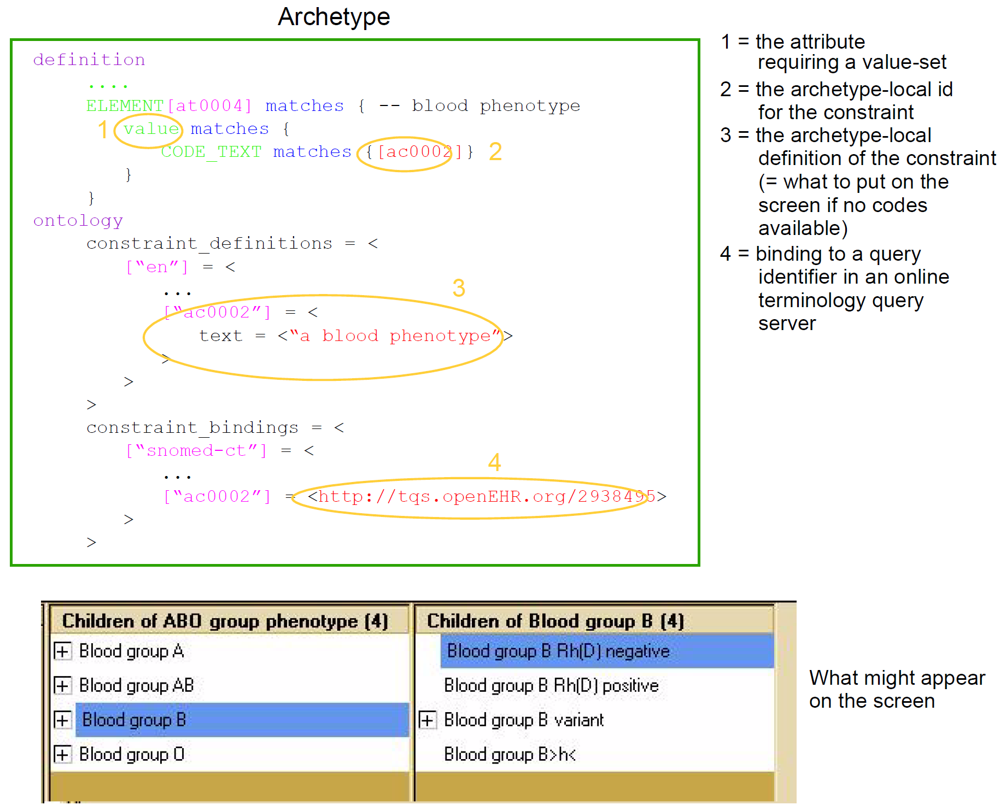

= Terminology in openEHR

== Overview

openEHR archetypes provide a powerful way to define the meaning of clinical and related data, and
to connect, or "bind", data to recognised terminologies such as LOINC, ICDx, ICPC, SNOMED-CT
and the many other terminologies and vocabularies used in healthcare. Terminology is used in
openEHR in the following ways:

* The values of coded attributes in the reference model are defined by an "openEHR" terminology.
* Each archetype contains its own internal terminology, defining the meaning of each element.
* Bindings to external terminologies can be included in an archetype, allowing direct mappings to terms, or mappings to queries that return specific value sets.
* Querying the EHR using external terminologies is supported by archetype bindings.

The following sections describe these features.

== Terminology to Support the Reference Model

openEHR has its own small terminology and code sets, which are used to provide the value sets of a
number of attributes in the reference model. Code sets are used to express well-known internationally
standardised lists of codes where the codes themselves have meaningful values e.g. the ISO 3166
country codes ("au", "cn", "pl" etc). Six such code sets are used by various attributes in the reference
model, each of type `CODE_PHRASE` (the openEHR type used to represent a term code).
For other coded attributes, such as `PARTICIPATION`.`_function_` in the reference model, the openEHR
terminology takes the more orthodox route in terminology design, and defines value sets in groups
using meaningless codes and rubrics. These attributes are always of type `DV_CODED_TEXT`; the code
itself is contained within the defining_code attribute.

The openEHR terminology is described in the openEHR Terminology specification <<openehr_terminology>>, with computable
expressions available at the openEHR terminology page <<openehr_terminology_resources>>.

== Archetype Internal Terminology

Archetypes contain their own local terminology (found in the 'ontology' section of an archetype).
The use of internal term sets is appropriate when there is no structure to the terms (ie no relationships)
and when synonyms are not important. Thus, the use is limited to small flat lists of terms. The advantages
of the terms being internal to the archetype, apart from computational efficiency mentioned
above, are:

* Queries can be based on archetypes alone and do not require interacting with a terminology server;
* Translation of the terms is made within an explicit thematic context (since every archetype is about a specific topic) and is therefore far more likely to be accurate;
* Many terms required in archetypes are not available even in very large terminologies;
* People can share data based on archetypes even if they do not share terminologies.

It is clear, however, that many archetypes require a connection to external terminologies to provide
the full benefits of automatic processing; this is described in the next section.
The internal terminology takes the form of a set of `{code, text, description}` semantic definitions for
each node of the archetype structure. Each such term is identified by an "at" (archetype term) code,
e.g. `[at0012]`. Each code defined locally in an archetype is used for one of two purposes:

* either to semantically identify the data nodes of the archetype (i.e. to "name" the data), or
* to provide value-sets for leaf attributes.

For example, the local codes in an "Apgar result" archetype could contain terms for "1 minute
event" and "2 minute event". These codes are associated with the reference model nodes within the
'definition' part of the archetype. In the Apgar example, the two codes (say `[at0003]` and `[at0026]`)
will be mapped to nodes of reference model type `EVENT` (`rm.data_structures.history` package),
as shown below. It is this mapping that is the basis for archetype paths: an archetype
path is simply the alternating pattern of reference model attribute names and node codes.

[source, cadl]
--------
OBSERVATION[at0000] matches { -- Apgar score
    data matches {
        HISTORY[at0002] matches { -- history
            events cardinality matches {1..*; unordered} matches {
                POINT_EVENT[at0003] occurrences matches {0..1} matches {-- 1 minute
                    offset matches {|PT1M|}
                    data matches {
                        ITEM_LIST[at0001] matches {-- structure
                            items cardinality matches {0..1; ordered} matches {
                                ELEMENT[at0005] occurrences matches {0..1} matches {-- Heart r
                                    value matches {
                                        ORDINAL matches {
                                            value matches {
                                                0|[local::at0006], -- No heart beat
                                                1|[local::at0007], -- Less than 100 bpm
                                                2|[local::at0008] -- Greater than 100 bpm
                                            }
                                        }
                                    }
                                }
                            }
                        }
                    }
                }
                POINT_EVENT[at0026] occurrences matches {0..1} matches {-- 2 minute
                    offset matches {|PT2M|}
                    data matches {
                        use_node ITEM_LIST /data[at0002]/events[at0003]/data[at0001]
                        ...
                    }
                }
            }
        }
    }
}
...
--------

The second use of local codes is as values. Above, the `ELEMENT` node identified by code
`[at0005]` has as its value constraint an `ORDINAL` type whose values can be 0, 1, or 2. Each of these
values is coded by the codes `[at0006]`, `[at0007]`, and `[at0008]`. An extract of the archetype ontology
showing these terms is shown below.

[source, odin]
--------
ontology
    primary_language = <"en">
    languages_available = <"en", "en-us">
    terminologies_available = <"LNC205", ...>
    term_definitions = <
        ["en"] = <
            items = <
                ["at0000"] = <
                    description = <"Clinical score derived from assessment of
                        breathing, colour, muscle tone, heart rate and reflex
                        response usually taken at 1, 5 and 10 minutes after birth">
                    text = <"Apgar score">
                >
                ["at0003"] = <
                    description = <"Apgar score at one minute">
                    text = <"1 minute">
                >
                ["at0006"] = <
                    description = <"No heart beat is present (palpation at base of
                        umbilical cord)">
                        text = <"No heart beat">
                >
                ["at0007"] = <
                    description = <"Heart rate of less than 100 beats per minute">
                    text = <"Less than 100 beats per minute">
                >
                ["at0008"] = <
                    description = <"Heart rate of greater than or equal to 100
                        beats per minute">
                    text = <"Greater than 100 beats per minute">
                >
                ["at0026"] = <
                    description = <"Apgar score 2 minutes after birth">
                    text = <"2 minute">
                >
            >
        >
    >
    term_bindings = <
        ["LNC205"] = <
            items = <
            ["/data[at0002]/events[at0003]/data/items[at0025]"] = <[LNC205::9272-6]> -- 1 minute total
            ["/data[at0002]/events[at0026]/data/items[at0025]"] = <[LNC205::9271-8]> -- 2 minute total
        >
    >
--------

== Binding to External Terminologies

=== Binding External Terminology Codes to Archetype Codes

The first kind of binding is the ability within an archetype to map an internal code to a code from an
external terminology. The bindings are grouped on the basis of external terminology, allowing any
given internal code in an archetype to be bound to codes in multiple terminologies. Usually, coverage
provided by external terminologies is incomplete, and the mappings may be approximate, so care
must be taken in creating the mappings in the first place. In the example shown above, two
paths are shown respectively as being bound to LOINC codes for 1-minute and 2-minute Apgar total.
In this example, the whole path is bound, meaning that the mapping only holds between `[at0025]` and
`[LNC205::9272-6]` when `[at0025]` occurs in the first path; when it occurs in the second path, the mapping
is to a different LOINC code. This is how so-called "pre-coordinated" codes from external terminologies
can be mapped to an openEHR archetype concept.

Bindings can also be made between atomic internal codes and external codes, in which case the
meaning is that the mapping always holds, no matter how many times the internal code is used within
the archetype.

==== Binding Terminology Value-sets to Archetypes
An important requirement with respect to terminology is that of specifying value sets for attributes
defined in archetypes. Sometimes value sets are defined locally within the archetype, because the
terms are not available in published terminologies, and in any case may be too hard to define therein,
due to the lack of encapsulation. The terms "no effort", "moderate effort" and "crying" for example
are recognised values for the "breathing" attribute of an Apgar result1. In the context of Apgar /
breathing, the meanings are clear; clearly however a term with this rubric within a terminology like
SNOMED-CT would need to be pre-coordinated. More importantly, there seems to be little business
value in mapping a SNOMED term for "no effort", since a query for items containing "no effort" is
unlikely to be useful in a clinical context.

For many other kinds of attributes however, terminologies are an appropriate source of values. Often
such attributes define kinds of real world phenomena, such as kinds of disease and blood groups,
rather than qualities of a phenomenon such as "no effort", or "blue". For these attributes a different
kind of connection to external terminology is required. This is achieved in a similar way as for single
code bindings: an internal code is defined, in this case an "ac" code ("ac" = archetype constraint), and
this is bound to queries to one or more external terminologies, whose result would be a (possibly
structured) value set from that terminology. The logical scheme is illustrated in the figure below, where he
attribute value to be coded is "blood group phenotype".

[.text-center]
.Archetype Constraint Binding

Currently there is no standard for such queries. This does not affect archetypes directly, since they
simply hold an identifier for a query; the query itself is defined within a "terminology query server".
The result of this query is a list of blood group phenotypes, which might appear as shown at the bottom
of the figure <<archetype_constraint_binding>>.

== Querying using External Terminologies

Querying through EHR data is frequently cited to be the major utility of terminology with respect to
health information. With the mappings defined in archetypes, a number of approaches are possible,
however the semantics of the intended query need to be understood first. Consider a query for "adenocarcinoma"
on a patient record. SNOMED-CT includes 63 terms beginning with "adenocarcinoma"
(and 171 terms which include the word as a secondary part of the phrase), some as children of a common
parent. Nevertheless, the terms do not all have a single common parent; a choice has to be made
of which terms correspond to the intent of the query. If it is to find any previous diagnosis of "adenocarcinoma",
then at least the terms of the form `[snomed-ct::254626006|adenocarcinoma of lung|]`,
"... of liver" have to be included. These are within the "clinical finding" hierarchy, so the use of these
latter terms should ensure that matches are not made with other uses of the same terms in the record,
e.g. "fear of adenocarcinoma" or "minimal risk of adenocarcinoma". Such correct matching is completely
dependent upon the correct use of SNOMED-CT terms in the first place by the software application
and/or user creating the data. It is easy to imagine an application that saves data (including
openEHR data) in the form of two name/value pairs: `<"principal diagnosis", [snomed-ct::35917007|adenocarcinoma|])>` and `<"site", "lung">`. Querying using `[snomedct::254626006|adenocarcinoma of lung|]` will fail, even though this is exactly the meaning of the data. The data are not wrong
as such, but the lesson is clear: coding of data and code use in queries must be governed by common
models, otherwise there is no hope of reliably processing the data.

Under the openEHR aproach, path-based querying can be used to specify (for example):

* find `EVALUATIONs` based on a `problem-diagnosis-histological_staging` archetype with a value at the path `/data/items[at0002.1.1]/value/code` (histological diagnosis) equal-to-or-subsumed-by "clinical finding" and equal-to or-subsumed-by "adenocarcinoma".

The assumption here is that the value at this path was _originally_ restricted by the archetype from
which the path is taken, to conforming to the relation {is-a "clinical finding" and is-a "abnormal morphological
mass"}. Any finding of adenocarcinoma of the lung is then forced to be from the resulting
subsumption hierarchy; other "adenocarcinoma" terms cannot be wrongly used in this position.

However, even if the archetype had not restricted the value in this way, the same query which
searched for any "adenocarcinoma" term at the same path could reasonably be used to locate "previous
diagnoses of adenocarcinoma", since this is the only use of the archetype. In a similar way, archetype
path-based querying can be used to distinguish the other potential ambiguities described in
the section on <<Entries and clinical statements>>.
