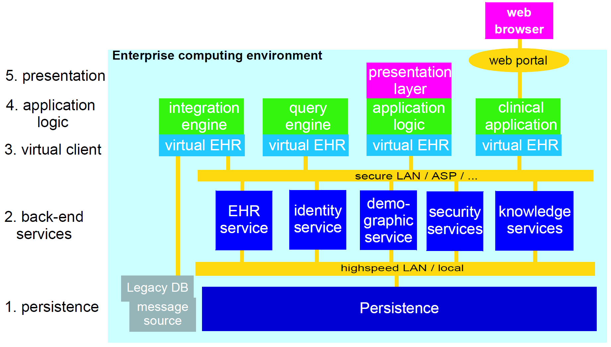
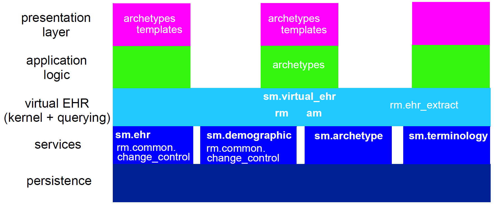

= Deployment

== 5-tier System Architecture

Previous sections have described the software architecture of the openEHR specifications. Here we
describe how the package architecture can be applied to building real systems. The general architectural
approach in any openEHR system can be considered as 5 layers (i.e. a “5-tier” architecture). The
tiers are as follows.

. _persistence_: data storage and retrieval.
. back-end services: including EHR, demographics, terminology, archetypes, security, record location, and so on. In this layer, the separation of the different services is transparent, and each service has a coarse-grained service interface.
. _virtual EHR_: this tier is the middleware, and consists of a coherent set of APIs to the various back-end services providing access to the relevant services, thereby allowing user access to the EHR; including EHR, demographics, security, terminology, and archetype services. It also contains an archetype- and template-enabled kernel, the component responsible for creating and processing archetype-enabled data. In this tier, the separation of backend services is hidden, only the functionality is exposed. Other virtual clients are possible, consisting of APIs for other combinations of back-end services.
. _application logic_: this tier consists of whatever logic is specific to an application, which might be a user application, or another service such as a query engine.
. _presentation layer_: this layer consists of the graphical interface of the application, where applicable.

The same tiers can be used in large deployments, as shown in the next figure or simply as layers in single-
machine applications.

[.text-center]
.Basic Enterprise EHR System Architecture

The figure below illustrates an approximate mapping of major parts of the openEHR software architecture
to the 5-tier scheme. Clearly where parts of the architecture are used will depend on various implementation
choices; the mapping shown is therefore not definitive. Nevertheless, the principal use of
parts of the architecture is likely to be similar in most systems, as follows:

* RM and AM: mainly used to construct an archetype- and template-processing kernel;
* RM `common.change_control` package: provides the logic for versioning in versioned services such as the EHR and demographics;
* SM: various service model packages define the exposed interfaces of major services;
* SM `virtual_ehr` package defines the API of the virtual EHR component;
* archetypes: archetypes might be assumed directly in some applications, e.g. a specialist peri-natal package might be partly based on a family of archetypes for this specialisation;
* templates: both archetypes and templates will be used in the presentation layer of applications.

Some will base the GUI code on them, while others will have either tool-generate
code, or dynamically generate forms based on particular templates and archetypes.
In the future, an abstract persistence API and optimised persistence models (transformations of the
existing RM models) are likely to be published by openEHR in order to help with the implementation
of databases.

[.text-center]
.Mapping of software architecture to deployment architecture

