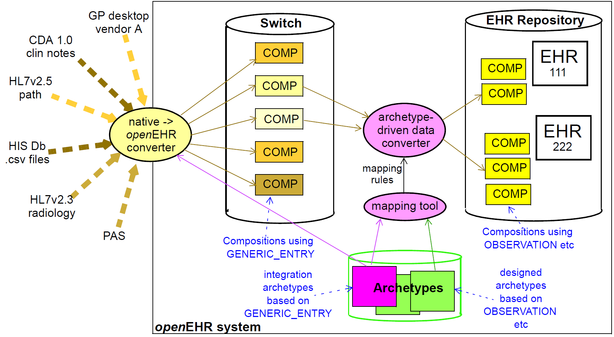

= Integrating openEHR with other Systems

== Overview

Getting data in and out of the EHR is one of the most basic requirements openEHR aims to satisfy. In
“greenfield” (new build) situations, and for data being created by GUI applications via the openEHR
EHR APIs, there is no issue, since native openEHR structures and semantics are being used. In almost
all other situations, existing data sources and sinks have to be accounted for. In general, external or
‘legacy’ data (here the term is used for convenience, and does not imply anything about the age or
quality of the systems in question) have different syntactic and semantic formats than openEHR data,
and seamless conversion requires addressing both levels.

Existing data sources and sinks include relational databases, HL7v2 messages, HL7 CDA documents
and are likely to include CEN EN13606 data. HL7v2 messages are probably one of the most common
sources of pathology messages in many countries; EDIFACT messages are another. More recently,
HL7v2 messages have been designed for referrals and even discharge summaries. Not all legacy systems
are standardised; most hospital and GP products have their own private models of data and terminology
usage.

The primary need with respect to legacy data is to be able to convert data from multiple mutually
incompatible sources into a single, standardised patient-centric EHR for each patient, that can then be
longitudinally viewed and queried. This is what enables GP and specialist notes, diagnoses and plans
to be integrated with laboratory results from multiple sources, patient notes, administrative data and
so on, to provide a coherent record of the patient journey.

In technical terms, a number of types of incompatibility have to be dealt with. There is no guarantee
of correspondence of scope of incoming transactions and target openEHR structures - an incoming
document for example might correspond to a number of clinical archetypes. Structure will not usually
correspond, with legacy data (particularly messages) usually having flatter structures than those
defined in target archetypes. Terminology use is extremely variable in existing systems and messages,
and also has to be dealt with. Data types will also not correspond directly, so that for example, a mapping
between an incoming string “110/80 mmHg” and the target openEHR form of two
`DV_QUANTITY` objects each with their own value and units has to be made.

== Integration Archetypes

The foundation of a key approach to the integration problem is the use of two kinds of archetypes. So
far in this document “archetypes” has meant “designed” archetypes, generally clinical, demographic
or administrative. The common factors for all such archetypes are:

* they are based on the main part of the reference model, particularly the Entry subtypes `OBSERVATION`, `EVALUATION`, `INSTRUCTION` and `ACTION`;
* they are consciously designed from scratch by groups of domain specialists, and integrated into the existing library of openEHR archteypes;
* there is one archetype per identifiable health “concept”, such as an observation type, person type etc.

A second category of archetypes is “integration” archetypes. These are characterised as follows:

* they are based on the same high-level types (`COMPOSITION`, `SECTION` etc), but use the Entry subtype `GENERIC_ENTRY` (see EHR Information Model);
* they are designed to mimic the structure of legacy or existing data or messages; the design effort therefore is completely different, and is more likely to be done by IT or other technical staff who are familiar with the structures of the incoming data;
* there is one integration archetype per message type or identifiable source data that makes sense as a transaction to the EHR.

In the data integration environment, “designed” archetypes always define the target structures, coding
and other semantics of data, while “integration” archetypes provide the means mapping of external
data into the openEHR environment.

== Data Conversion Architecture

The integration archetype-based strategy for importing data into an openEHR system, shown below, consists of two steps.

[.text-center]
.Data Integration using openEHR

Firstly, data are converted from their original syntactic format into openEHR `COMPOSITION` / `SECTION` / `GENERIC_ENTRY` structures, shown in the openEHR integration switch. Most of the data will
appear in the `GENERIC_ENTRY` part, controlled by an integration archetype designed to mimic the
incoming structure (such as an HL7v2 lab message) as closely as possible; `FEEDER_AUDIT` structures
are used to contain integration meta-data. The result of this step is data that are expressed in the
openEHR type system (i.e. as instances of the openEHR reference model), and are immediately amenable
to processing with normal openEHR software.

In the second step, semantic transformation is effected, by the use of mappings between integration
and designed archetypes. Such mappings are created by archetype authors using tools. The mapping
rules are the key to defining structural transformations, use of terminological codes, and other
changes. Serious challenges of course remain in the business of integrating heterogeneous systems;
some of these are dealt with in the Common IM document sections on Feeder systems.
