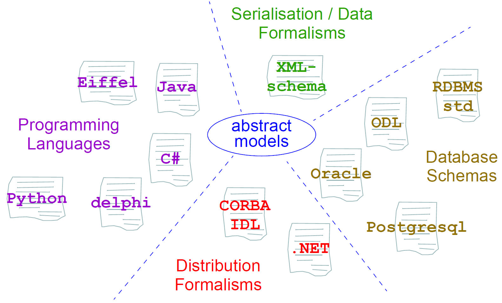

= Implementation Technology Specifications

== Overview

ITSs are created by the application of transformation rules from the “full-strength” semantics of the
abstract models to equivalents in a particular technology. Transformation rules usually include mappings
of:

* names of classes and attributes;
* property and function signature mapping;
* mapping of basic types e.g. strings, numerics;
* how to handle multiple inheritance;
* how to handle generic (template) types;
* how to handle covariant and contravariant redefinition semantics;
* the choice of mapping properties with signature `xxxx:T` (i.e. properties with no arguments) to stored attributes (`xxxx:T`) or functions (`xxxx():T`);
* how to express pre-conditions, post-conditions and class invariants;
* mappings between assumed types such as List<>, Set<> and inbuilt types.

ITSs are being developed for a number of major implementation technologies, as summarised below.
Implementors should always look for an ITS for the technology in question before proceeding. If
none exists, it will need to be defined. A methodology to do this is being developed.
The figure below illustrates the implementation technology specification space. Each specification documents
the mapping from the standard object-oriented semantics used in the openEHR abstract models,
and also provides an expression of each of the abstract models in the ITS formalism.

[.text-center]
.Implementation Technologies

