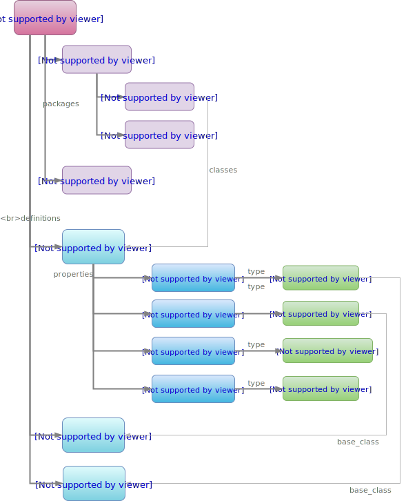

= BMM Structure

== Overview

The `core` package defines the main BMM model. The following figure shows it in overview.

[.text-center]
.base.bmm.core Package - Overview
image::{uml_export_dir}/diagrams/BASE-bmm.core-overview.svg[id=core_package_overview, align="center"]

A BMM model is structured in the same basic way as a UML model, i.e. with a hierarchical package containment structure and a set of class definitions. Class definitions consist of property definitions, each of which refers to a type, which in turn refers to a 'base class'. 

[.text-center]
.BMM model structure

== Packages

In BMM, packages have the same role as in UML - as non-semantic organisational logical containers of classes, usually corresponding to file system folders in software implementations. They provide an organisational convenience, and in an instantiated BMM model, contain references to class definitions. A model validity checker ensures that every class is contained within exactly one package.

Package namespaces ('paths' in BMM) are recognised by only used to specify package structures in the serialsed form in an efficient way, i.e. by using paths to avoid defining a hierarchy in which only lower packages contain classes.

== Documentation

A `_documentation_` attribute is inherited from `BMM_MODEL_ELEMENT` into `BMM_CLASS`, `BMM_PROPERTY`, `BMM_MODEL` and `BMM_PACKAGE` (the latter two via `BMM_PACKAGE_CONTAINER`), enabling packages, classes and properties to be individually documented.

[.tbd]
TBD: expand to be of type `Hash<String,Any>` or similar?

== Model

The `BMM_MODEL` class defines the single instance of each distinct BMM model that may exist in a system of models. It provides an interface that enables any class definition to be retrieved, as well as various accessor functions to interrogate the model.

== Class Definitions

include::{uml_export_dir}/classes/bmm_definitions.adoc[]
include::{uml_export_dir}/classes/bmm_model_element.adoc[]
include::{uml_export_dir}/classes/bmm_model_core.adoc[]
include::{uml_export_dir}/classes/bmm_package_container.adoc[]
include::{uml_export_dir}/classes/bmm_package.adoc[]
include::{uml_export_dir}/classes/bmm_model.adoc[]
