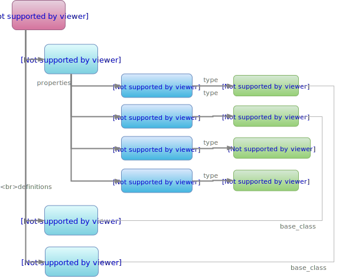
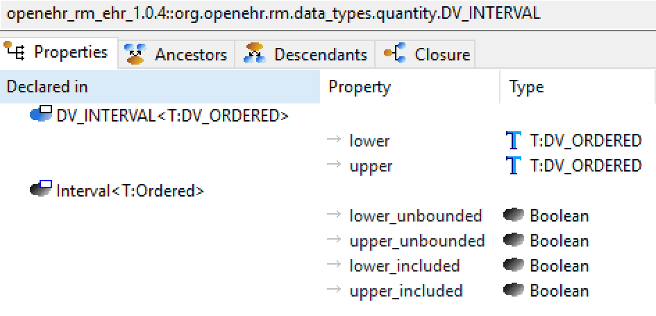

= BMM Entities

== Overview

The following UML diagram shows the semantically important part of the BMM, defining classes and types, known collectively as entities.

[.text-center]
.base.bmm.core Package - Main
image::{uml_export_dir}/diagrams/BASE-bmm.core-main.svg[id=core_package_main, align="center"]

The general structure of a BMM consists of a set of classes, whose properties are each typed by an instance of `BMM_TYPE`, as shown below. Structures specific to generic and container types are shown in relevant sections below. 

[.text-center]
.BMM entities

== The Class / Type Division

One of the foundational concepts in the BMM is a distinction between _class_ and _type_, in common with the type systems of the modern forms of most object-oriented languages. Classes are _definitional_ entities, while 'type' has two meanings: as the static (design time) type of a class feature (property or function result), and as the dynamic (run-time) type of the object referred to by or computed by that feature. In a static model, types are references. For simple types, they refer to the corresponding simple class definition, but for generic types, they refer to a particular usage of a generic class definition. A given generic class may generate numerous types.

This central division in the BMM is reflected in the two classes `BMM_CLASS` and `BMM_TYPE`. The common parent class `BMM_ENTITY` defines a small number of properties that classify both classes and types in a model: `_entity_metatype_`, `_is_abstract_` and `_is_primitive_`. These are combined to produce a String classifier `_entity_category_`, which can be used to help visualise elements of a BMM model.

The Boolean attribute `_is_abstract_` on an entity indicates an abstract class in a BMM model, or a type based on an abstract class. The attribute `_is_primitive_` indicates that a class in a BMM model is considered to be part of a primitive type set (typically corresponding to primitive types in another type system); for types, it is derived from the setting of the `_base_class_`. Primitive status has no effect on BMM model semantics, and is provided as a convenience for visualisation and type-system mapping.

The taxonomy represented by `BMM_ENTITY._entity_category_` is illustrated below.

[.text-center]
.BMM entity taxonomy
image::diagrams/bmm_entity_taxonomy.svg[id=bmm_entity_taxonomy, align="center"]

=== Class Definitions

include::{uml_export_dir}/classes/bmm_entity.adoc[leveloffset=+1]

== Types

=== Overview

Types are used for three purposes in a BMM model:

* to define the _type of a property_;
* to define _formal type parameters_ in a generic class;
* to define type(s) of _inheritance ancestors of class definitions_.

Every type entity can be mapped back to its generating class(es), which provide the definitional basis for the type. The BMM class `BMM_TYPE` and its descendants define the kinds of types available in a BMM model. The `BMM_TYPE` class includes features common to all meta-types:

* _base_class_: a reference to the generating class;
* _type_name_: the effective type name of an entity; for simple classes, this will just be the class name (`BMM_CLASS._name_`); for generic and container classes it will be generic name such as `List<T>`, `Interval<T>` etc; for feature types it will be the declared type, i.e. a simple name, an open type name (e.g. `T`) or a generic type name (e.g. `Interval<Time>`);
* _type_signature_: a form of the type name that can be used as a fully-defined type signature, which for generic classes includes generic constrainer types, giving a signature such as `Interval<T:Ordered>`.

Below `BMM_TYPE` are the abstract meta-type `BMM_UNITARY_TYPE` and the concrete meta-type `BMM_CONTAINER_TYPE` and its specialisation `BMM_INDEX_CONTAINER_TYPE`. `BMM_UNITARY_TYPE` corresponds to meta-types whose instances are singular, while the container meta-types correspond to collections of instances. The latter are further described below. This division is made to enable BMM to directly support collections in the type system.

Singular meta-types are further distinguished as either formal generic parameters (`BMM_PARAMETER TYPE`) and 'defined' types, i.e. types with class definitions, via the abstract meta-type `BMM_DEFINED_TYPE`. The subtypes of the BMM defined meta-type are `BMM_SIMPLE_TYPE` and `BMM_GENERIC _TYPE`, corresponding to the standard notions of type familiar in modern programming languages.

=== Generic Types

A generic type is any type based on a generic class, which has one or more open type parameters that are substituted for actual types in its declaration. For example, the generic type `Interval<Quantity>` can be used in a model that contains the generic class `Interval<T:Ordered>` and `Quantity`. A typical programmatic usage of such a type, and its instantiated BMM model structure are shown below.

[.text-center]
.Generic type - closed simple
image::diagrams/bmm_structure-generic_1.svg[id=bmm_structure_generic_1, align="center"]

The parameters of a generic type may be:

* a substitution of a formal parameter from the generic class with a concrete type, including other generic types and container types;
* an unsubstituted formal parameter. 

Consequently, a generic type may be:

* _fully closed_: all formal parameters substituted e.g. `Interval<Quantity>`;
* _partially closed_: at least one formal parameter is substituted e.g. `Document<ClinicalContent, U>`;
* _fully open_: no formal parameters substituted, e.g. `Document<T, U>`.

The feature `_is_partially_closed ()_` defined on `BMM_GENERIC_TYPE` can be used to distinguish the latter two cases. 

The following diagram shows the BMM instance structure created for a generic type based on a generic class and another generic type.

[.text-center]
.Generic type - closed container
image::diagrams/bmm_structure-generic_2.svg[id=bmm_structure_generic_2, align="center"]

The following shows the BMM instance structure of a generic type that is fully open.

[.text-center]
.Generic type - open
image::diagrams/bmm_structure-generic_3.svg[id=bmm_structure_generic_3, align="center"]

=== Container Types

In object-oriented type theory, 'container' types are generic types whose outer class happens to have the semantics of a container object, such as a list, set etc. In the BMM, containers and non-container generic types are distinguished via the classes `BMM_GENERIC_TYPE` and `BMM_CONTAINER_TYPE`. This allows the BMM to treat container types in a special way. A `BMM_CONTAINER_TYPE` can be thought of as a 1:N counterpart to a `BMM_UNITARY_TYPE`, such as the type `List<Paragraph>` with respect to `Paragraph`. `BMM_GENERIC_TYPE` is typically used for objects considered to be singular, but whose types are a product of the base class and one or more parameter types, e.g. `Interval<Quantity>`. 

The explicit provision of `BMM_CONTAINER_TYPE` enables BMM models to mention logical linear container types such as `Array<T>`, `List<T>` and `Set<T>`, on the assumption of their standard semantics in computer science , without worrying about providing concrete types which may be numerous and also variable across programming languages, e.g. `ArrayedList<T>`, `LinkedSet<T>`, `ArrayedStack<T>` and so on. (This corrects one of the errors in UML, which does not represent containment via typing, but via cardinality, and uniqueness constraints.)

The following diagram shows how the container type `List<Paragraph>` is represented in a BMM model.

[.text-center]
.Container Type
image::diagrams/bmm_structure-container.svg[id=bmm_structure_container, align="center"]

=== Type Conformance

In object-oriented theory, the important relationship between types is substitutability, which governs which instances may be dynamically attached to property references of particular declared static types. In the BMM, a type is _conformant_ to another type if the base classes of its constituent elements are inheritance descendants of the corresponding elements of the other type. This is known in object-oriented type theory as _covariant_ conformance.

An algorithm to determine conformance of two type-names (e.g. to implement `BMM_MODEL._type_conforms_to()_`) is as follows:

[source,java]
--------
Boolean type_conforms_to (String this_type, other_type) {
    BMM_TYPE_NAME this_type_name, other_type_name;

    if attached create_type_name_from_string (a_this_type) as this_type_name and
        attached create_type_name_from_string (other_type) as other_type_name
    {
        this_base_class = this_type_name.name;
        other_base_class = other_type_name.name;
        
        if (this_base_class.is_case_insensitive_equal (other_base_class) or else 
            class_definition (this_base_class).has_ancestor_class (other_base_class)) 
        {
            // handle case where formal generic names appear in type name
            BMM_DEFINED_CLASS this_bmm_def_class = class_definition (this_base_class);
            if (valid_generic_type_name (this_type) and this_bmm_def_class instanceOf BMM_GENERIC_CLASS) {

                // in the case of both being generic, we need to compare generics
                // to start with, the number of generics must match
                BMM_DEFINED_CLASS other_bmm_def_class = class_definition (other_base_class);
                if (valid_generic_type_name (other_type) and other_bmm_def_class instanceOf BMM_GENERIC_CLASS) {
                    this_type_gen_params = this_type_name.generic_parameters_type_list;
                    other_type_gen_params = other_type_name.generic_parameters_type_list;
                    
                    if (this_type_gen_params.count = other_type_gen_params.count) {
                    
                        Iterator<String> this_gen_parms_it = this_type_gen_params.iterator();
                        Iterator<String> other_gen_parms_it = other_type_gen_params.iterator();

                        Boolean result = True;
                        String this_type_gen_type, other_type_gen_type;
                        
                        while (this_gen_parms_it.hasNext() && other_gen_parms_it.hasNext() || !result) {
                            // first we convert any open generic parameters to their conformance types
                            // We assume type names of 1 letter are open parameters
                            String this_gen_parm = this_gen_parms_it.next();
                            String other_gen_parm = other_gen_parms_it.next();
                            if (formal_generic_parameter_name (this_gen_parm))
                                this_type_gen_type = this_bmm_gen_class.generic_parameter_conformance_type (this_gen_parm);
                            else
                                this_type_gen_type = this_gen_parm;
    
                            if (formal_generic_parameter_name (other_gen_parm))
                                other_type_gen_type = other_bmm_gen_class.generic_parameter_conformance_type (other_gen_parm);
                            else
                                other_type_gen_type = other_gen_parm;

                            -- now do the test
                            result = type_conforms_to (this_type_gen_type, other_type_gen_type);
                        }
                        
                        return result;
                    }

                // Conforms - case where anc type is not provided in generic form, but desc is
                // e.g. Interval<Integer> conforms to Interval
                else
                    return True;

            // in the following case, the descendant type is not generic, 
            // so the ancestor type cannot be either, for conformance
            else
                return not valid_generic_type_name (other_type);
        }
    }
}

--------

=== Class Definitions

include::{uml_export_dir}/classes/bmm_type.adoc[leveloffset=+1]
include::{uml_export_dir}/classes/bmm_unitary_type.adoc[leveloffset=+1]
include::{uml_export_dir}/classes/bmm_simple_type.adoc[leveloffset=+1]
include::{uml_export_dir}/classes/bmm_container_type.adoc[leveloffset=+1]
include::{uml_export_dir}/classes/bmm_generic_type.adoc[leveloffset=+1]
include::{uml_export_dir}/classes/bmm_parameter_type.adoc[leveloffset=+1]

== Classes

=== Overview

Class definitions are the core of any BMM model. BMM distinguishes between simple, enumeration and generic class definitions via the descendants of `BMM_CLASS`, i.e. `BMM_SIMPLE_CLASS`, `BMM_ENUMERATION` and `BMM_GENERIC_CLASS`. Class properties are defined using the generic class `BMM_PROPERTY <T: BMM_TYPE>`. The use of a generic meta-type provides a formal way of expressing the semantics of property meta-types as listed above. 

The type of a property in a BMM model has one of the following `BMM_TYPE` descendants as its metatype:

* a `BMM_SIMPLE_TYPE` - corresponds to a simple type such as `Document`;
* a `BMM_GENERIC_TYPE` - a type generated by the use of a generic class with one or more filled type parameters, e.g. `Interval<Time>`, `Packet<T,Payload>`;
* a `BMM_CONTAINER_TYPE` - a type generated by the use of a linear container type such as `List<T>`, `Hash<T,U>` with actual generic parameters;
* a `BMM_PARAMETER_TYPE` - corresponds to a generic parameter type from the class type definition, e.g. `T`, `U` etc.

In modelling or programming terms, the properties of a class constitute the features it _introduces with respect to its inheritance parent(s)_. We can think of this list of properties as the _differential_ set. A 'top-level' class with no declared inheritance ancestor is considered to inherit by default from the `Any` class, and its property set is relationally differential to the top class.

In contrast, the _effective_ set of properties for an instance at runtime is the result of evaluating these lists of properties down the inheritance hierarchy to obtain the _flat_ set of properties. The features _properties_ and _flat_properties_ defined on `BMM_CLASS` provide access to these two lists for any class.

=== Primitive Classes

As noted above, class definitions can be marked as being 'primitive' within a BMM model, enabling them to be visualised and queried as a separate group without otherwise impacting on the semantics of the entity in BMM meta-type system. The following shows part of a BMM model in which a number of classes are classified as primitive (shown in light and dark grey).

[.text-center]
.Primitive classes
image::images/awb_primitive_types.png[id=awb_primitive_types, align="center", width="55%"]

=== Enumeration Classes

The enumeration meta-type adds a set of enumeration labels and option `String` or `Integer` values, in the manner of contemporary languages such as Java and C#. This meta-type allows classes to be declared in a BMM to be enumerations without either having to manufacture a representation from simple class definitions, or having to replicate the representatino of enumerations in some target language. The following screenshot shows how a BMM integer enumeration class appears within a BMM model.

[.text-center]
.Enumeration Example
image::images/awb_enumeration.png[id=awb_enumeration, align="center", width="65%"]

=== Generic Classes

The generic class meta-type `BMM_GENERIC_CLASS` adds generic parameters to `BMM_CLASS`, enabling formal generic parameters to be represented. Each such parameter is expressed using an instance of `BMM_PARAMETER_TYPE` which names the parameter and optionally allows a type constraint to be associated with it, in the usual object-oriented fashion. In BMM, formal parameters have single-letter names, such as 'T', 'U' etc, following typical usage in programming languages. The following example shows a generic class `Interval<T:Ordered>`, which is a class `Interval` with one formal parameter `T` constrained to be of type `Ordered` or any descendant.

[.text-center]
.BMM class - generic class
image::images/awb_generic_class.png[id=awb_generic_class, align="center", width="50%"]

== Inheritance

=== Simple Inheritance

The BMM supports single and multiple inheritance, although it does not distinguish between different types of inheritance relation as some programming languages do. Inheritance is formally defined to be between a class definition (an instance of `BMM_CLASS`) and a defined type, i.e. a `BMM_SIMPLE_TYPE` or `BMM_GENERIC_TYPE`. This is because inheritance parents of a class may be:

* a simple class;
* a generic class;
* an effective generic type, i.e. with one or more formal parameters substituted.

The general case for all three is represented by the corresponding _type_, i.e., simple type or generic type.

The evaluation of inheritance relations defined in a BMM model results in an acyclic graph such that ancestors and descendants can be visualised for any class. The following screen shot shows the ancestors view of a class `OBSERVATION`.

[.text-center]
.BMM class - ancestors view
image::images/awb_class_ancestors.png[id=awb_class_ancestors, align="center", width="45%"]

The next screenshot shows the descendants view of one of the ancestor classes of the same class.

[.text-center]
.BMM class - descendants view
image::images/awb_class_descendants.png[id=awb_class_descendants, align="center", width="45%"]

=== Generic Inheritance

Inheritance between generic classes works in the same way as for simple classes, with the additional semantics of formal parameter inheritance, which are as follows:

* each unsubstituted formal parameter of the parent type must have a same-named counterpart in the formal parameters of the inheriting class;
* the formal parameters of the inheriting class may further constrain any of the ancestor type's formal parameters.

The following example shows the class `DV_INTERVAL<T:DV_ORDERED>` inheriting from `Interval<T:Ordered>`. Here the type constraint `Ordered` is being covariantly narrowed to `DV_ORDERED`, which inherits from the `Ordered` type.

[.text-center]
.Generic inheritance

== Multiple Inheritance

Multiple inheritance is typically used in the definition of classes that have a Liskov substitution inheritance relation as well as a re-use inheritance relation. The following shows a class `DV_INTERVAL<T>` multiply inheriting from `Interval<T>` and `DATA_VALUE`, where the latter is considered the substitutable type, and the former an interface re-use.

[.text-center]
.Multiple inheritance
image::images/awb_multiple_inheritance.png[id=awb_multiple_inheritance, align="center", width="45%"]

=== Class Definitions

include::{uml_export_dir}/classes/bmm_class.adoc[leveloffset=+1]
include::{uml_export_dir}/classes/bmm_simple_class.adoc[leveloffset=+1]
include::{uml_export_dir}/classes/bmm_enumeration.adoc[leveloffset=+1]
include::{uml_export_dir}/classes/bmm_enumeration_string.adoc[leveloffset=+1]
include::{uml_export_dir}/classes/bmm_enumeration_integer.adoc[leveloffset=+1]
include::{uml_export_dir}/classes/bmm_generic_class.adoc[leveloffset=+1]

== Properties

Properties in BMM class definitions occur in two flavours, corresponding to the unitary and container type meta-types. The `BMM_PROPERTY<T:BMM_TYPE>` meta-type defines semantics common all properties, including `_name_` and `_is_mandatory_`, and `_type_`, a generically typed reference to the property type in a BMM model. Properties also include two other Boolean meta-data items, `_is_im_runtime_` and `_is_im_infrastructure_`, which can be used to classify property values in a model according to use in runtime systems. These may be individually set, or both may be False. The three meaningful value settings are as follows:

* _both False_: the value of the property is considered to be design-time constrainable;
* _is IM runtime_: True if the property value is only knowable at runtime, as is typically the case for identifiers, dates etc;
* _is infrastructure_: True if the property is not a user- or business-oriented property, but something required by software design, e.g instance identifier, meta-data etc.

Unitary properties in a BMM model are instances of the types `BMM_PROPERTY<BMM_SIMPLE_TYPE>` and so on. Container properties are instances of the type `BMM_CONTAINER_PROPERTY`, which inherits from `BMM_PROPERTY<BMM_CONTAINER_TYPE>`, in order to add the meta-data item `_cardinality_`, which enables the possible number of container elements to be constrained, corresponding to the multiplicities used at the end of UML associations.

The following example shows a BMM class in a model whose flat properties have different settings of the `_is_im_runtime_` and `_is_im_infrastructure_` meta-data flags: property names in black are neither; those in grey are IM runtime, and those in light frey are infrastructure properties.

[.text-center]
.BMM class - properties view
image::images/awb_class_properties.png[id=awb_class_properties, align="center", width="50%"]

=== Class Definitions

include::{uml_export_dir}/classes/bmm_property.adoc[leveloffset=+1]
include::{uml_export_dir}/classes/bmm_container_property.adoc[leveloffset=+1]

