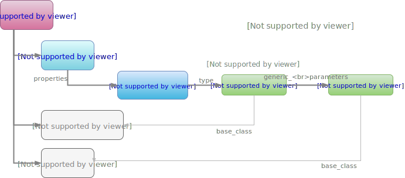
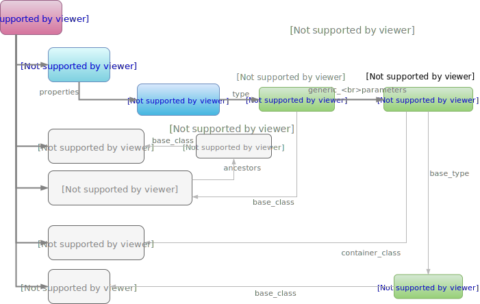
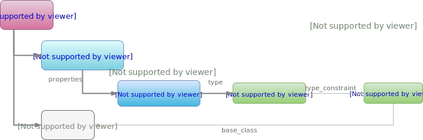
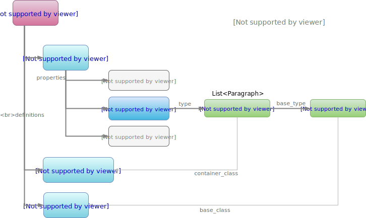
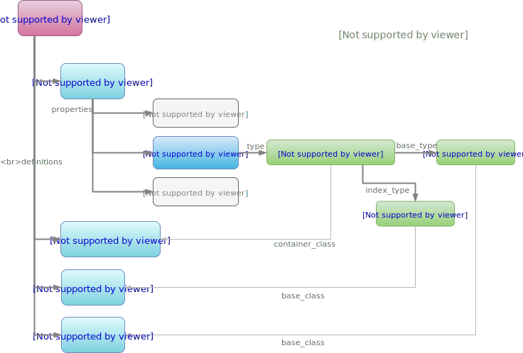

= Types

== Overview

Types are understood as the _formal classifiers_ of object instances in BMM, in both a static sense and dynamically, i.e. at execution time, when polymorphic attachment is possible. Types are defined indirectly via the definitions of classes and their constituent parts. Types are used for three purposes in a BMM model:

* to define the _type of a property_;
* to define _formal type parameters_ in a generic class;
* to define type(s) of _inheritance ancestors of class definitions_.

Every type entity can be mapped back to its generating class(es), which provide the definitional basis for the type. The BMM class `BMM_TYPE` and its descendants define the kinds of types available in a BMM model. The `BMM_TYPE` class includes features common to all meta-types:

* _effective_base_class_: a reference to the effective generating class;
* _type_name_: the effective type name of an entity; for simple classes, this will just be the class name (`BMM_CLASS._name_`); for generic and container classes it will be generic name such as `List<T>`, `Interval<T>` etc; for feature types it will be the declared type, i.e. a simple name, an open type name (e.g. `T`) or a generic type name (e.g. `Interval<Time>`);
* _type_signature_: a form of the type name that can be used as a fully-defined type signature, which for generic classes includes generic constrainer types, giving a signature such as `Interval<T:Ordered>`.

Below `BMM_TYPE` are the abstract meta-type `BMM_UNITARY_TYPE` and the concrete meta-type `BMM_CONTAINER_TYPE` and its specialisation `BMM_INDEXED_CONTAINER_TYPE`. `BMM_UNITARY_TYPE` corresponds to meta-types whose _instances are unitary_ i.e. singular, while the container meta-types correspond to _collections of instances_. The latter are further described below. This division is made to enable BMM to directly support collections in the type system.

Unitary meta-types are further distinguished as either formal generic parameters (`BMM_PARAMETER TYPE`) and _defined_ types, i.e. types with class definitions, via the abstract meta-type `BMM_DEFINED_TYPE`. The subtypes of the BMM defined meta-type are `BMM_SIMPLE_TYPE` and `BMM_GENERIC _TYPE`, corresponding to the standard notions of type familiar in modern programming languages. The class definitions of instances (i.e. BMM model class deifintions) of these meta-types are available via the property `_base_class_`, of meta-type `BMM_CLASS` for a BMM simple type, and `BMM_GENERIC_CLASS` for BMM generic type.

== Simple Type

A _simple type_ is a type based only on a _simple class_, which is a class with no formal generic parameters. An instance of a simple type is fully described by the class on which it is based, with the ony difference being the usual object-oriented possibility of polymorphic attachments of sub-objects whose dynamic types conform to their static type counterparts in the original simle type. Thus, for example, a class `Organisation` may have a property `_managers_` of static type `List<Person>`. An instance of the simple type `Organisation` might have its `_managers_` property attached to an instance of `List<Manager>`, which is legal as long as `Manager` conforms to `Person`, which it will do it the same-named classes inherit in the usual sense.

== Generic Type

A _generic type_ is any type based on a _generic class_, which has one or more open type parameters that are substituted for actual types in its declaration. For example, the generic type `Interval<Quantity>` can be used in a model that contains the generic class `Interval<T:Ordered>` and `Quantity`. A typical programmatic usage of such a type, and its instantiated BMM model structure are shown below.

[.text-center]
.Generic type - closed simple

The parameters of a generic type may be:

* a substitution of a formal parameter from the generic class with a concrete type, including other generic types and container types;
* an unsubstituted formal parameter. 

Consequently, a generic type may be:

* _fully closed_: all formal parameters substituted e.g. `Interval<Quantity>`;
* _partially closed_: at least one formal parameter is substituted e.g. `Document<ClinicalContent, U>`;
* _fully open_: no formal parameters substituted, e.g. `Document<T, U>`.

The feature `_is_partially_closed ()_` defined on `BMM_GENERIC_TYPE` can be used to distinguish the latter two cases. 

The following diagram shows the BMM instance structure created for a generic type based on a generic class and another generic type.

[.text-center]
.Generic type - closed container

The following shows the BMM instance structure of a generic type that is fully open.

[.text-center]
.Generic type - open

== Container Types

In object-oriented type theory, 'container' types are generic types whose outer class happens to have the semantics of a container object, such as a list, set etc. Container types such as `List<T>` and `Set<T>` are used ubiquitously in object models. In the BMM, containers and non-container generic types are distinguished via the meta-classes `BMM_GENERIC_TYPE` and `BMM_CONTAINER_TYPE`. This allows the BMM to treat container types in a special way. A `BMM_CONTAINER_TYPE` can be thought of as a 1:N counterpart to a `BMM_UNITARY_TYPE`, such as the type `List<Paragraph>` with respect to `Paragraph`. `BMM_GENERIC_TYPE` is typically used for objects considered to be singular, but whose types are a product of the base class and one or more parameter types, e.g. `Interval<Quantity>`. 

The explicit provision of `BMM_CONTAINER_TYPE` enables BMM models to mention logical linear container types such as `Array<T>`, `List<T>` and `Set<T>`, on the assumption of their standard semantics in computer science , without worrying about providing concrete types which may be numerous and also variable across programming languages, e.g. `ArrayedList<T>`, `LinkedSet<T>`, `ArrayedStack<T>` and so on. (This corrects one of the errors in UML, which does not represent containment via typing, but via cardinality, and uniqueness constraints.)

The following diagram shows how the container type `List<Paragraph>` is represented in a BMM model.

[.text-center]
.Container Type

One other container type is also ubiquitous in object models and object-oriented programming: indexed containers, commonly known under the type name `Hash<K,V>`, `HashMap<K,V>`, `HashTable<K,V>`, `Dictionary<K,V>` and so on. This type always takes two parameters, a key type and a value type. The key type must be such that hash values can be generated, and may be any type, but practically speaking, is almost always a `String` or `Integer`, or a Date/Time type if such exists.

The indexed container is represented by the meta-type `BMM_INDEXED_CONTAINER_TYPE`, which inherits from `BMM_CONTAINER_TYPE`, and adds the property `_index_type_`. The following diagram shows how the container type `Hash<String, Person>` is represented in a BMM model.

[.text-center]
.Indexed Container Type

== Type Conformance

In object-oriented theory, the important relationship between types is substitutability, which governs which instances may be dynamically attached to property references of particular declared static types. In the BMM, a type is _conformant_ to another type if the base classes of its constituent elements are inheritance descendants of the corresponding elements of the other type. This is known in object-oriented type theory as _covariant_ conformance.

An algorithm to determine conformance of two type-names (e.g. to implement `BMM_MODEL._type_conforms_to()_`) is as follows:

[source,java]
--------
Boolean type_conforms_to (String this_type, other_type) {
    BMM_TYPE_NAME this_type_name, other_type_name;

    if attached create_type_name_from_string (a_this_type) as this_type_name and
        attached create_type_name_from_string (other_type) as other_type_name
    {
        this_base_class = this_type_name.name;
        other_base_class = other_type_name.name;
        
        if (this_base_class.is_case_insensitive_equal (other_base_class) or else 
            class_definition (this_base_class).has_ancestor_class (other_base_class)) 
        {
            // handle case where formal generic names appear in type name
            BMM_DEFINED_CLASS this_bmm_def_class = class_definition (this_base_class);
            if (valid_generic_type_name (this_type) and this_bmm_def_class instanceOf BMM_GENERIC_CLASS) {

                // in the case of both being generic, we need to compare generics
                // to start with, the number of generics must match
                BMM_DEFINED_CLASS other_bmm_def_class = class_definition (other_base_class);
                if (valid_generic_type_name (other_type) and other_bmm_def_class instanceOf BMM_GENERIC_CLASS) {
                    this_type_gen_params = this_type_name.generic_parameters_type_list;
                    other_type_gen_params = other_type_name.generic_parameters_type_list;
                    
                    if (this_type_gen_params.count = other_type_gen_params.count) {
                    
                        Iterator<String> this_gen_parms_it = this_type_gen_params.iterator();
                        Iterator<String> other_gen_parms_it = other_type_gen_params.iterator();

                        Boolean result = True;
                        String this_type_gen_type, other_type_gen_type;
                        
                        while (this_gen_parms_it.hasNext() && other_gen_parms_it.hasNext() || !result) {
                            // first we convert any open generic parameters to their conformance types
                            // We assume type names of 1 letter are open parameters
                            String this_gen_parm = this_gen_parms_it.next();
                            String other_gen_parm = other_gen_parms_it.next();
                            if (formal_generic_parameter_name (this_gen_parm))
                                this_type_gen_type = this_bmm_gen_class.generic_parameter_conformance_type (this_gen_parm);
                            else
                                this_type_gen_type = this_gen_parm;
    
                            if (formal_generic_parameter_name (other_gen_parm))
                                other_type_gen_type = other_bmm_gen_class.generic_parameter_conformance_type (other_gen_parm);
                            else
                                other_type_gen_type = other_gen_parm;

                            -- now do the test
                            result = type_conforms_to (this_type_gen_type, other_type_gen_type);
                        }
                        
                        return result;
                    }

                // Conforms - case where anc type is not provided in generic form, but desc is
                // e.g. Interval<Integer> conforms to Interval
                else
                    return True;

            // in the following case, the descendant type is not generic, 
            // so the ancestor type cannot be either, for conformance
            else
                return not valid_generic_type_name (other_type);
        }
    }
}

--------

== Class Definitions

include::{uml_export_dir}/classes/bmm_type.adoc[]
include::{uml_export_dir}/classes/bmm_unitary_type.adoc[]
include::{uml_export_dir}/classes/bmm_simple_type.adoc[]
include::{uml_export_dir}/classes/bmm_container_type.adoc[]
include::{uml_export_dir}/classes/bmm_indexed_container_type.adoc[]
include::{uml_export_dir}/classes/bmm_generic_type.adoc[]
include::{uml_export_dir}/classes/bmm_parameter_type.adoc[]
