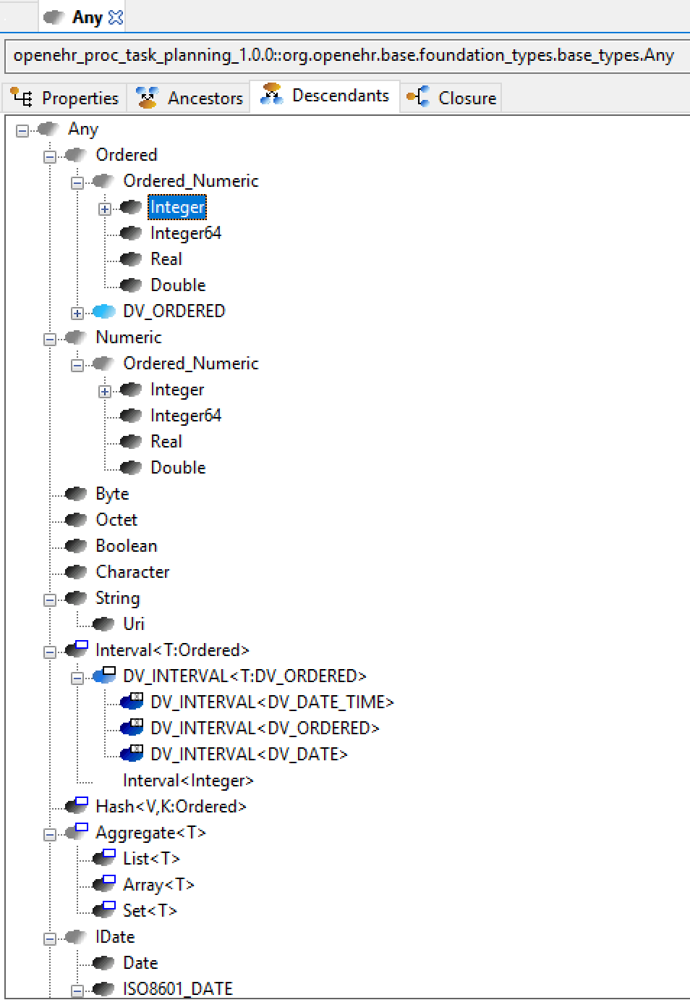
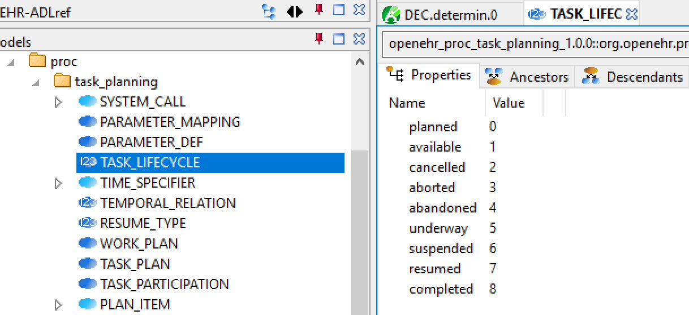
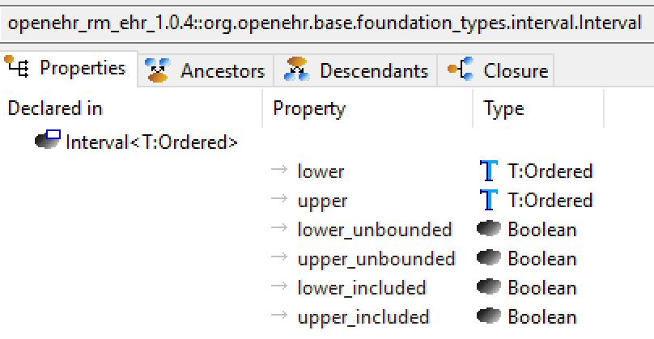

= Classes

== Overview

Class definitions are the core of any BMM model. BMM distinguishes between simple, enumeration and generic class definitions via the descendants of `BMM_CLASS`, i.e. `BMM_SIMPLE_CLASS`, `BMM_ENUMERATION` and `BMM_GENERIC_CLASS`. Class properties are defined using the generic class `BMM_PROPERTY <T: BMM_TYPE>`. The use of a generic meta-type provides a formal way of expressing the semantics of property meta-types as listed above. 

The type of a property in a BMM model has one of the following `BMM_TYPE` descendants as its metatype:

* a `BMM_SIMPLE_TYPE` - corresponds to a simple type such as `Document`;
* a `BMM_GENERIC_TYPE` - a type generated by the use of a generic class with one or more filled type parameters, e.g. `Interval<Time>`, `Packet<T,Payload>`;
* a `BMM_CONTAINER_TYPE` - a type generated by the use of a linear container type such as `List<T>`, `Hash<T,U>` with actual generic parameters;
* a `BMM_PARAMETER_TYPE` - corresponds to a generic parameter type from the class type definition, e.g. `T`, `U` etc.

In modelling or programming terms, the properties of a class constitute the features it _introduces with respect to its inheritance parent(s)_. We can think of this list of properties as the _differential_ set. A 'top-level' class with no declared inheritance ancestor is considered to inherit by default from the `Any` class, and its property set is relationally differential to the top class.

In contrast, the _effective_ set of properties for an instance at runtime is the result of evaluating these lists of properties down the inheritance hierarchy to obtain the _flat_ set of properties. The features _properties_ and _flat_properties_ defined on `BMM_CLASS` provide access to these two lists for any class.

== Primitive Classes

As noted above, class definitions can be marked as being 'primitive' within a BMM model, enabling them to be visualised and queried as a separate group without otherwise impacting on the semantics of the entity in BMM meta-type system. The following shows part of a BMM model in which a number of classes are classified as primitive (shown in light and dark grey).

[.text-center]
.Primitive classes

== Enumeration Classes

The enumeration meta-type adds a set of enumeration labels and option `String` or `Integer` values, in the manner of contemporary languages such as Java and C#. This meta-type allows classes to be declared in a BMM to be enumerations without either having to manufacture a representation from simple class definitions, or having to replicate the representatino of enumerations in some target language. The following screenshot shows how a BMM integer enumeration class appears within a BMM model.

[.text-center]
.Enumeration Example

== Generic Classes

The generic class meta-type `BMM_GENERIC_CLASS` adds generic parameters to `BMM_CLASS`, enabling formal generic parameters to be represented. Each such parameter is expressed using an instance of `BMM_PARAMETER_TYPE` which names the parameter and optionally allows a type constraint to be associated with it, in the usual object-oriented fashion. In BMM, formal parameters have single-letter names, such as 'T', 'U' etc, following typical usage in programming languages. The following example shows a generic class `Interval<T:Ordered>`, which is a class `Interval` with one formal parameter `T` constrained to be of type `Ordered` or any descendant.

[.text-center]
.BMM class - generic class

== Properties

Properties in BMM class definitions occur in two flavours, corresponding to the unitary and container type meta-types. The `BMM_PROPERTY<T:BMM_TYPE>` meta-type defines semantics common all properties, including `_name_` and `_is_mandatory_`, and `_type_`, a generically typed reference to the property type in a BMM model. Properties also include two other Boolean meta-data items, `_is_im_runtime_` and `_is_im_infrastructure_`, which can be used to classify property values in a model according to use in runtime systems. These may be individually set, or both may be False. The three meaningful value settings are as follows:

* _both False_: the value of the property is considered to be design-time constrainable;
* _is IM runtime_: True if the property value is only knowable at runtime, as is typically the case for identifiers, dates etc;
* _is infrastructure_: True if the property is not a user- or business-oriented property, but something required by software design, e.g instance identifier, meta-data etc.

Unitary properties in a BMM model are instances of the types `BMM_PROPERTY<BMM_SIMPLE_TYPE>` and so on. Container properties are instances of the type `BMM_CONTAINER_PROPERTY`, which inherits from `BMM_PROPERTY<BMM_CONTAINER_TYPE>`, in order to add the meta-data item `_cardinality_`, which enables the possible number of container elements to be constrained, corresponding to the multiplicities used at the end of UML associations.

The following example shows a BMM class in a model whose flat properties have different settings of the `_is_im_runtime_` and `_is_im_infrastructure_` meta-data flags: property names in black are neither; those in grey are IM runtime, and those in light frey are infrastructure properties.

[.text-center]
.BMM class - properties view
image::images/awb_class_properties.png[id=awb_class_properties, align="center", width="50%"]

== Class Definitions

include::{uml_export_dir}/classes/bmm_class.adoc[]
include::{uml_export_dir}/classes/bmm_simple_class.adoc[]
include::{uml_export_dir}/classes/bmm_enumeration.adoc[]
include::{uml_export_dir}/classes/bmm_enumeration_string.adoc[]
include::{uml_export_dir}/classes/bmm_enumeration_integer.adoc[]
include::{uml_export_dir}/classes/bmm_generic_class.adoc[]
include::{uml_export_dir}/classes/bmm_property.adoc[]
include::{uml_export_dir}/classes/bmm_container_property.adoc[]
